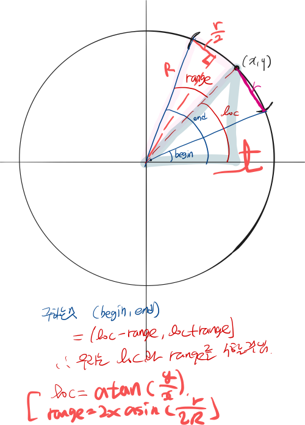

## 문제 

https://algospot.com/judge/problem/read/MINASTIRITH

성벽을 모두 감시하기 위해 필요한 최소 병사 수를 계산하는 문제 


## 풀이 

###  1. 이차원에서 일차원으로 




```cpp
void convertToRange() {
    for(int i=0; i<n; ++i){
        double loc = fmod(2*pi + atan2(y[i], x[i]), 2*pi); // 0~2pi
        double range = 2.0 *asin(r[i]/(2*R)); // 
        ranges[i]={loc-range, loc+range};
    }
    sort(ranges.begin(), ranges.end());
}
```


### 2. 선분을 덮는 문제 

왼쪽 끝을 넘어간 부분이 선분의 오른쪽 끝을 덮고 있음을 고려하는 알고리즘 필요 

먼저 알아야할 부분은 최적해에서 0을 포함하는 구간은 많아야 2개라는 것이다. 그 이유는 간단하다. 왼쪽에서 최대를 덮는 것 하나랑 오른쪽에서 최대를 덮는 것 하나를 고르면 되기 때문이다. 

그래서 이 문제를 어떻게 푸냐면 0을 덮는 구간을 하나씩 덮으면 나머지 구간은 일반적인 선분이 되기 때문에 그 선분에 대한 답을 구하는 것이다. 

1) 최적해에 0을 덮는 구간이 하나라면 : 위의 방법으로 가능 

2) 최적해에 0을 덮는 구간이 2개라면?? 

- 0이 두 구간의 중심 사이에 있을 때 

- 0이 두 구간의 중심 사이에 없을 때 

  *이걸 책에서 왜 언급했는지 모르겠다. 결국 하나고르면 끝인거 아닐까??*

  