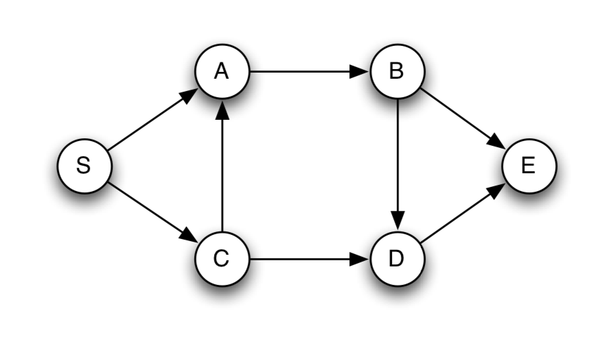

### 문제

**DAG** 에서 최장경로를 찾아라 

### 풀이 

#### DAG Longest path 

> [참고](http://www.mathcs.emory.edu/~cheung/Courses/171/Syllabus/11-Graph/Docs/longest-path-in-dag.pdf)

최단 경로 문제에서 탐욕적 방법이나 동적계획법을 사용할 수 있던 이유는 최단 경로가 **최적부분구조**를 가지고 있기 때문이다. 최단경로에서 **두 정점 간의 부분경로는 반드시 최단경로**여야 한다. 

그러나 최장경로문제에서는 최적부분구조가 성립하지 않기 때문에 동적계획법이나 탐욕적 방법을 사용할 수 없다. 

하지만 다행히도 DAG에서의 최장경로는 최적부분구조를 만족한다. 

:cat: *DAG는 항상 위상정렬할 수 있다.*

$dist(v)$ 를 S에서 v까지의 최장거리라고 하고 $\alpha(v)$ 를 실제 경로라고 하자. 그러면 $dist(D)$ 를 다음과 같이 쓸 수 있다. 

​											$dist(D)=max\{dist(B)+1, dist(C)+1\}$

여기서 subproblem은 $dist(B)$ 와 $dist(C)$ 로 둘 다 $dist(B)$ 보다 짧다. 당연히 

이처럼 $dist(B)$ 와 $dist(C)$ 도 다음과 같은 부분문제로 표현할 수 있다. 

​											$dist(B)=dist(A)+1$

​											$dist(C)=dist(S)+1$

들어오는 간선이 없는 정점은 empty set에 대한 최댓값을 취하므로 당연히 답은 0이다. 

​											$dist(S)=0$

​											$\alpha(S)=\{S\}$

DAG G에 대하여 dist(B)=3이고 dist(C)=1이므로 dist(D)=max{3+1, 1+1}=4 이고 이에 해당하는 실제 경로는 

​											$\alpha(D)=\alpha(B)\cup \{D\}=\{S, C,A,B,D\}$

따라서 S에서 임의의 정점 v까지의 최단 경로는 

​											$dist(v)=max_{(u,v)\in E}\{dist(u)+1\}$

따라서 시간복잡도는 당연히 $O(|V|+|E|)$

