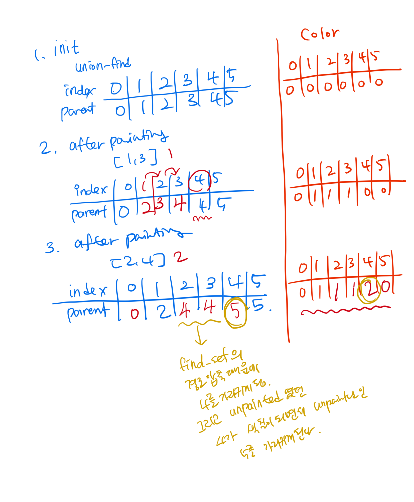

> 공통 원소가 없는, 상호 배타적인 부분 집합들로 나누어진 원소들에 대한 정보를 저장하고 조작하는 자료 구조

- 세가지 연산
  1. 초기화: n개의 원소가 각각의 집합에 포함되어 있도록 초기화
  2. 합치기(union): 두 원소 a, b가 주어질 때 이들이 속한 두 집합을 하나로 합침
  3. 찾기(find): 어떤 원소 a가 주어질 때 이 원소가 속한 집합 반환

### 배열로 상호 배타적 집합 표현하기 

> 가장 간단한 방법

- $belongsTo[i]=i$ 번 원소가 속하는 집합의 번호 

  : 초기화는 각각 다른 숫자로 크기가 1인 n개의 집합을 만듦

  - 합치기 연산은? 

    : 모든 원소를 순회하면서 한쪽 집합에 속한 원소들을 다른 집합으로 옮겨줘야함 = $O(n)$

    $\rightarrow$ 너무 느려! 

### 트리를 이용한 상호 배타적 집합의 표현 

- 두 원소가 같은 트리에 속해 있는지 확인하는 방법 (Find)

  : 각 원소가 포함된 트리의 루트를 찾은 뒤 같은 뒤 비교 

  - 모든 자식 노드가 부모에 대한 포인터를 가지고 있어야 함 

- 두 원소가 포함된 집합 합치는 방법 

  : 각 트리의 루트를 찾은 뒤, 하나를 다른 한쪽의 자손으로 넣음 

```c++
// 트리를 이용해 상호 배타적 집합 구현 
struct NaiveDisjointSet {
    vector<int> parent; 
    NaiveDisjointSet(int n): parent(n){ //init 
        for(int i=0; i<n; ++i){
            parent[i]=i;
        }
    }
    // u가 속한 트리의 루트의 번호를 반환 
    int find(int u) const {
        if(u==parent[u]) return u;
        return find(parent[u]);
    }
    // u가 속한 트리와 v가 속한 트리를 합침 
    void merge(int u, int v){
        u=find(u); v=find(v);
        if(u==v) return;
        parent[u]=v;
    }
}
```

- $find() , merge()$ 의 수행시간 

  : 해당 트리의 높이에 비례하는 시간 


### 상호 배타적 집합의 최적화 

> 트리가 한쪽으로 기울어지는 문제는 $O(n)$ 의 시간 복잡도를 유발 

- 해결책

  : 두 트리를 합칠 때 항상 높이가 더 낮은 트리를 더 높은 트리 밑에 집어넣음 (union-by-rank)

```c++
struct OptimizedDisjointSet{
    vector<int> parent, rank;
    OptimizedDisjointSet(int n) : parent(n), rank(n, 1){
        for(int i=0; i<n; ++i){
            parent[i]=i;
        }
    }
    int find(int u) const {
        if(u==parent[u]) return u; 
        return parent[u]=find(parent[u]); // 찾은 루트를 미리 바꿈으로 최적화 
    }
    
    void merge(int u, int v){
        u=find(u); v=find(v);
        if(u==v) return;
        if(rank[u]>rank[v]) swap(u, v);
        parent[u]=v;
        if(rank[u]==rank[v]) ++rank[v];
    }
}
```

- 합치기 연산과 찾기 연산의 시간 복잡도 

  : $O(lgN)$

  + 찾기 연산의 최적화까지 적용되었다면 찾기 연산은 상수 시간에 작동한다고 볼 수 있음 

    : 우리가 상상할 수 있는 모든 크기의 $n$에 대해 4 이하의 값을 가짐 


### Linking by Index / coin-flop linking 

트리의 rank를 통해 최적화하는 방식은 rank를 저장할 공간을 요구한다. 그래서 저장 공간을 요구하지 않는 randomized algorithm이 존재한다. 이는 `linking by index` 를 통해 `merge` 연산을 최적화할 수 있다. 

각 루트 값을 index를 통해 임의의 값으로 변환시킨다. 그리고 두 임의의 값을 비교하여 그 값이 작은 집합을 큰 집합에 붙인다. 

```cpp
void merge(int u, int v) {
  u = find(u);
  v = find(v);
  if(u==v) return; 
  if(index[u] < index[v]) {
    swap(u, v);
  }
  parent[v] = u; 
}
```

이는 그냥 동전 던져서 어디로 들어갈 지 정하는 솔루션과 시간복잡도가 같다고 오해할 수 있는데 사실이 아니다. 동전 던지기 솔루션의 시간복잡도는 $\Omega(nlogn/loglogn)$ 으로 성능이 더 안좋다.

> 어떻게 가능하지.. 나중에 증명해볼 것 


> https://cp-algorithms.com/data_structures/disjoint_set_union.html

## 어디에 쓸까? 

### 1. Connected components in a graph 

굉장히 많이 쓰이는 경우이다. 

정점 a, 정점 b가 같은 컴포넌트에 있는지 확인할 때 쓰인다. 유니온 파인드의 개념 자체를 사용하면 되므로 쉽게 풀 수 있다. 

이 응용이 중요한 이유는 크루스칼 알고리즘으로 MST를 찾을 때 유니온 파인드를 통해 시간복잡도를 줄일 수 있기 때문이다. 

### 2. Search for connected components in an image 

한 이미지에 $n\times m$ 픽셀이 있다고 하자. 원래 이 픽셀들은 하얀 색인데 몇 개만 검정색이다. 알고 싶은 것은 이 이미지에서 하얀색인 컴포넌트의 개수이다. 

이 문제는 `DFS or BFS` 로도 해결할 수 있지만 유니온 파인드로 푸는 장점이 있다. 유니온 파인드로 이 문제를 풀면 행렬을 행마다 처리할 수 있다. 이게 무슨 소린가? 

유니온 파인드를 사용하면 연결 관계를 찾을 때 이전 행과 현재 행만 필요하다.  즉 메모리가 $O(n\times m)$ 이 아니라 $O(min(n, m))$ 만 있으면 된다. 

### 3. Store additional information for each set 

유니온 파인드를 통해서 각 집합의 정보들을 쉽게 저장할 수 있다. 

쉬운 예가 집합의 사이즈. 

### 4. Compress jumps along a segment / Painting subarrays offline 

유니온 파인드가 많이 쓰이는 또 다른 예이다. 정점의 집합이 있고 각 정점은 다른 정점으로 가는 단 하나의 간선을 가진다고 하자. 유니온 파인드가 있으면 시작점에서부터 모든 간선을 지난 도착점을 거의 `상수시간`에 알아낼 수 있다. 

> 저 사실로 저 문제로 넘어간다고? 

이 문제의 좋은 예가 `problem of painting subarrays` 이다. 길이 `L` 인 배열이 있고 각 원소는 0이다. 이제 subarray [l, r]를 색 `c` 로 색칠할 거고 이를 `(l, r, c)` 라고 하자. 구하고자 하는 것은 모든 색칠을 완료했을 때 각 원소의 색이다. 

유니온 파인드로 이 문제를 풀려면 각 셀이 오른쪽에서 가장 인접한 색칠 되지 않은 셀을 가리키도록 해야된다. 밑의 그림에서 표현해보았다. 



이제 문제를 풀어보자. 쿼리를 거꾸로 생각한다. 왜? 쿼리를 실행할 때 정확하게 subarray[l, r] 에서 색칠되지 않은 셀을 가리킬 수 있다. 다른 셀들은 이미 마지막 색깔로 나타내지니까. 

경로압축으로만 최적화를 하고 rank를 사용한 최적화는 하지 않는다. 그러므로 머지할 때마다 시간복잡도는 $O(logn)$ 이다. 

```cpp
for(int i=0; i<=L; ++i) {
  make_set(i);
}

for(int i=m-1; i>=0; --i) {
  int l = query[i].l;
  int r = query[i].r;
  int c = query[i].c; 
  for(int v = find_set(l); v<=r; v=find_set(v)) {
    answer[v] = c; 
    parent[v] = v+1;
  }
}
```

만약 rank에 의한 최적화까지 한다면 다음 unpainted cell을 가리키는 `end` 배열을 추가로 사용해야 한다. 그렇게 하면 시간복잡도는 $O(\alpha(n))$ 이다.  

> 왜지!! 

### 5. Support distances up to representations

한 정점과 그 그래프 (정점이 속한 집합)을 대표하는 정점과의 거리를 구하는데 사용할 수 있다. 

경로 압축을 안쓰면 재귀적으로 거리를 구해야해서 비효율적이다. 경로 압축을 사용하면 각 노드에 부모까지의 거리를 추가적으로 저장함으로써 거리를 구할 수 있다. 

```cpp
void make_set(int v) {
  parent[v] = {v, 0};
  rank[v] = 0; 
}

pair<int, int> find_set(int v) {
  if(v!=parent[v].first) {
    int len = parent[v].second;
    parent[v] = find_set(parent[v].first);
    parent[v].second += len;
  }
  return parent[v];
}

void union_sets(int a, int b) {
  a = find_set(a).first; 
  b = find_set(b).first; 
  if(a!=b) {
    if(rank[a]<rank[b])
      swap(a, b);
    parent[b] = {a, 1};
    if(rank[a] == rank[b])
      rank[a]++;
  }
}
```


### 6. Support the parity of the path length / Checking bipartiteness online 

루트까지 길이를 저장하는 것처럼 루트 전의 경로 길이의 parity를 유지할 수 있다.  뭔소린지 모르겠음 

### 7. Offline RMQ in $O(\alpha (n))$ on average / Arpa's trick

배열 `a[]` 가 주어졌을 때 부분 배열에서 최솟값을 구해야한다. 

유니온 파인드로 이걸 어떻게 해? 

```cpp
struct Query {
  int L, R, idx;
};

vector<int> answer; 
vector<vector<Query>> container; 

stack<int> s; 
for (int i=0; i<n; ++i) {
  while(!s.empty() && a[s.top] > a[i]) {
    parent[s.top()] = i;
    s.pop();
  }
  s.push(i);
  for (Query q:container[i]) {
    answer[q.idx] = a[find_set(q.L)];
  }
}
```

이 접근 방법은 오프라인으로만 작동한다. 즉, 모든 쿼리를 미리 알고 있어야 한다. 

### 8. Offline LCA in $O(\alpha (n))$ on average 

> https://cp-algorithms.com/graph/lca_tarjan.html


### 9. Storing the Union Find explicitly in a set list / Applications of this idea when merging various data structures 


### 10. Storing the Union Find by maintaing a clear tree structure / Online bridge finding in $O(\alpha (n))$ on average 

> https://cp-algorithms.com/graph/bridge-searching-online.html


 