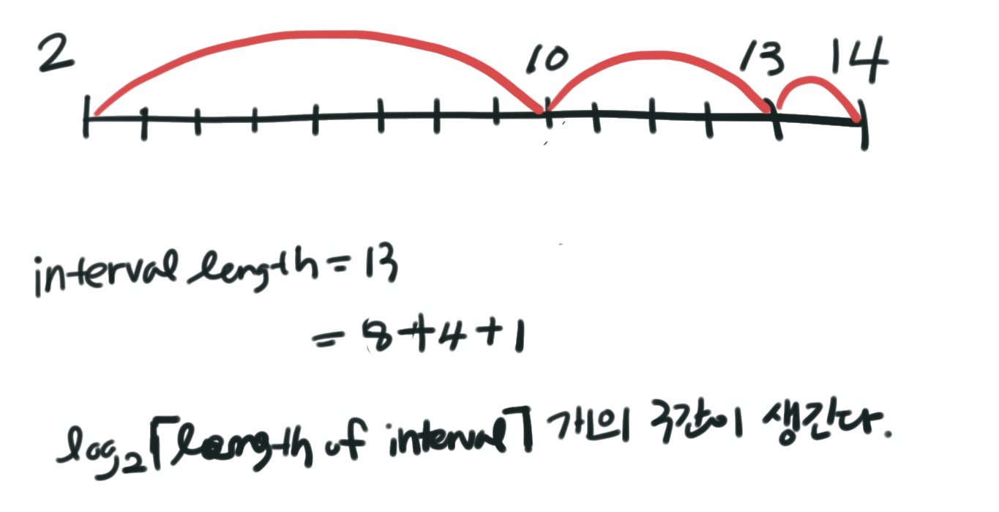

> https://cp-algorithms.com/data_structures/sparse-table.html

Sparse Table은 `range query` 가 가능한 자료구조이다. 대부분의 쿼리를 $O(logn)$ 에 해결할 수 있다. 그런데 이건 구간 트리도 할 수 있잖아요? 

Sparse Table의 강점은 RMQ를 $O(1)$ 에 해결할 수 있다는 것이다. 하지만 만능은 아닌데, 변치 않는 배열 (즉, 갱신할 수 없음)에 대해서만 이러한 시간복잡도를 가진다. 

## Idea 

모든 음이 아닌 정수는 2진법으로 표현 가능하다. 당연히도. 

그래서 모든 구간을 2의 지수승의 크기를 갖는 구간들로 쪼개버릴 수 있는 것이다. 




Sparse table의 기본 아이디어는 이 구간들에 대해 모든 답을 미리 구해놓는다는 것이다. 


## Precomputation

2차원 배열 `st[i][j]`을 이용해서 미리 계산해 놓는다.

- `st[i][j] = [i, i+2^j-1] 범위에 대한 답` 
- `i=start, j=size of interval`

```cpp
int st[MAX][K+1]; 

for (int i=0; i<N; ++i) {
  st[i][0] = f(arr[i]);
}

for (int j=1; j<=K; ++j) {
  for (int i=0; i+(1<<j)<=N; ++i) {
    st[i][j] = f(st[i][j-1], st[i+(1<<j-1)][j-1]);
  }
}
```

DP로 `st` 를 채울 수가 있다. 다음과 같은 점화식으로!

- $[i, i+2^i-1] = f([i, i+2^{j-1}-1], [i+2^{j-1}, i+2^j-1])$

그래서 처음 `st` 를 채우는데 걸리는 시간은 $O(NlogN)$ 이 된다. 


## Range Sum Queries 

어떻게 [L, R]의 Sum을 구할 수 있을까? 답은 구간을 쪼개는 것이다. 


```cpp
long long sum = 0;
for (int j=K; j>=0; j--) {
  if((1<<j)<=R-L+1) {
    sum += st[L][j];
    L += 1<<j;
  }
}
```


## Range Minimum Queries (RMQ)

RMQ가 바로 Sparse table을 쓰는 이유이다. 앞에서 Sum을 구하던 것과 다르게 최솟값은 같은 값을 여러번 적용해도 상관이 없다. 예를 들어 `arr = [1, 2, 3, 4, 5]` 에서 구간 [0, 4]의 최솟값을 구한다고 했을 때 `[1, 2, 3, 4]` 와 `[2, 3, 4, 5]` 두 구간의 최솟값의 최솟값을 구해도 답은 1이 된다. 

그래서 다음과 같이 구간 [L, R]의 최솟값을 구할 수 있다. 

`min(st[L][j], st[R-2^j + 1][j]) where j=log(R-L+1)`

```cpp
// log 값을 빠르게 구하려고 먼저 구해놓는다. 
int log[N+1];
log[1] = 0;
for(int i=2; i<=N; i++)
  log[i] = log[i/2] + 1;

int j = log[R-L+1];
int minimum = min(st[L][j], st[R-(1<<j)+1][j]);
```

시간복잡도는 보이는 것 처럼 $O(1)$ 이다. 


## Example 

> http://codeforces.com/problemset/problem/872/B

### 문제

배열 `a1, a2, ...an` 과 정수 `k` 가 주어진다. 이 배열을 정확히 `k` 개의 조각으로 나눠야 한다. 각 구간에서 최솟값을 구하고 그 k개의 최솟값 중에 최댓값을 구할 건데 그 최댓값이 뭘까? 이게 문제야? 

### 풀이

구간이 1개일 때랑 2개일 때랑 3개 이상일 때로 나눌 수 있다. 

1. 구간이 1개 일 때 

   : 무조건 전체 구간이 답이 되므로 답은 최솟값이다. 

2. 구간이 2개일 때 

   : 이 때는 구간을 다 반으로 쪼개서 해봐야한다. 여기서 Sparse table을 사용하자. 사실 logn으로만 구해지면 뭘써도 상관 없을듯. 

3. 구간이 3개일 때 

   : 최댓값을 하나의 구간으로 무조건 지정해주면 되므로 답은 최댓값이다. 

```cpp
#include <iostream>
#include <vector>
#include <algorithm>
using namespace std;

int st[100001][20], log[100001];

int getMin(int l, int r) {
    int j = log[r - l + 1];
    return min(st[l][j], st[r - (1 << j)+1][j]);
}

int main() {
    int n, k, minimum = 1000000000, maximum = -1000000000;
    cin >> n >> k;

    vector<int> arr(n);
    for (auto &a:arr) {
        cin >> a;
        minimum = min(minimum, a);
        maximum = max(maximum, a);
    }

    log[1] = 0;
    for (int i = 2; i <= n; ++i) {
        log[i] = log[i / 2] + 1;
    }

    for (int i = 0; i < n; ++i) {
        st[i][0] = arr[i];
    }

    for (int j = 1; j <= log[n] + 1; ++j) {
        for (int i = 0; i + (1 << j) <= n; ++i) {
            st[i][j] = min(st[i][j - 1], st[i + (1 << (j - 1))][j - 1]);
        }
    }

    if (k == 1)
        cout << minimum;
    else if (k == 2) {
        int ret = -1000000000;
        for (int mid=0; mid<n-1; ++mid) {
            ret = max({ret, getMin(0, mid), getMin(mid+1, n-1)});
        }
        cout << ret;
    } else {
        cout << maximum;
    }
    //std::cout << "Hello, World!" << std::endl;
    return 0;
}
```

풀면서 느낀거지만 인덱스 실수하기 딱 좋은 것 같다. 연습이 필요해 :disappointed:

