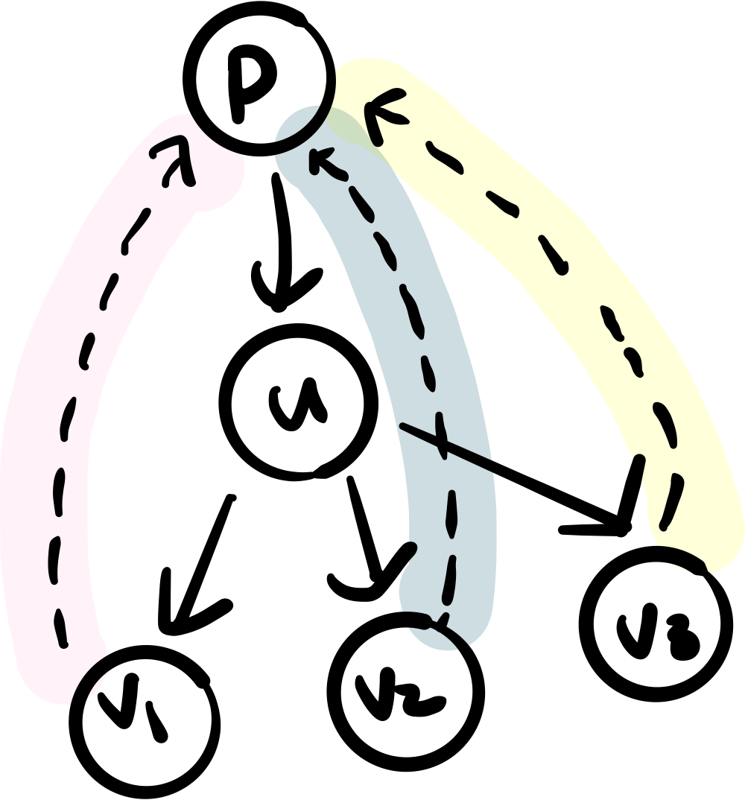
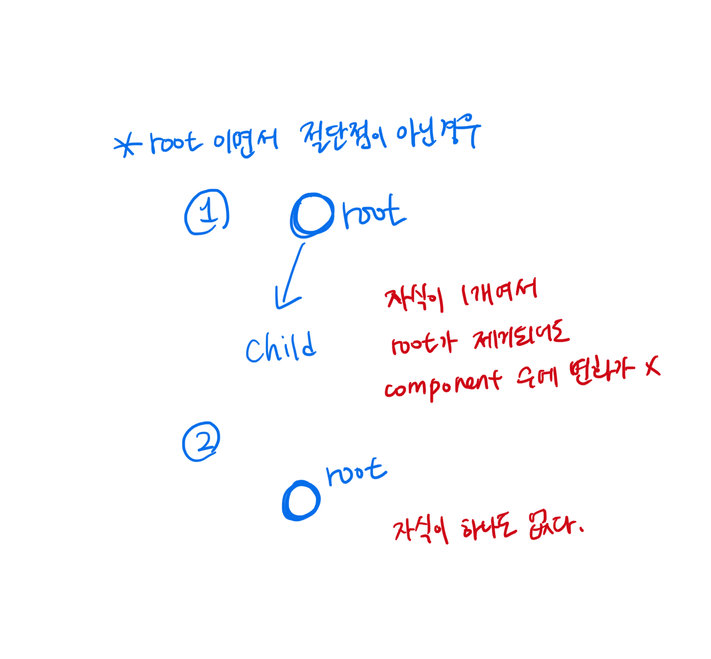
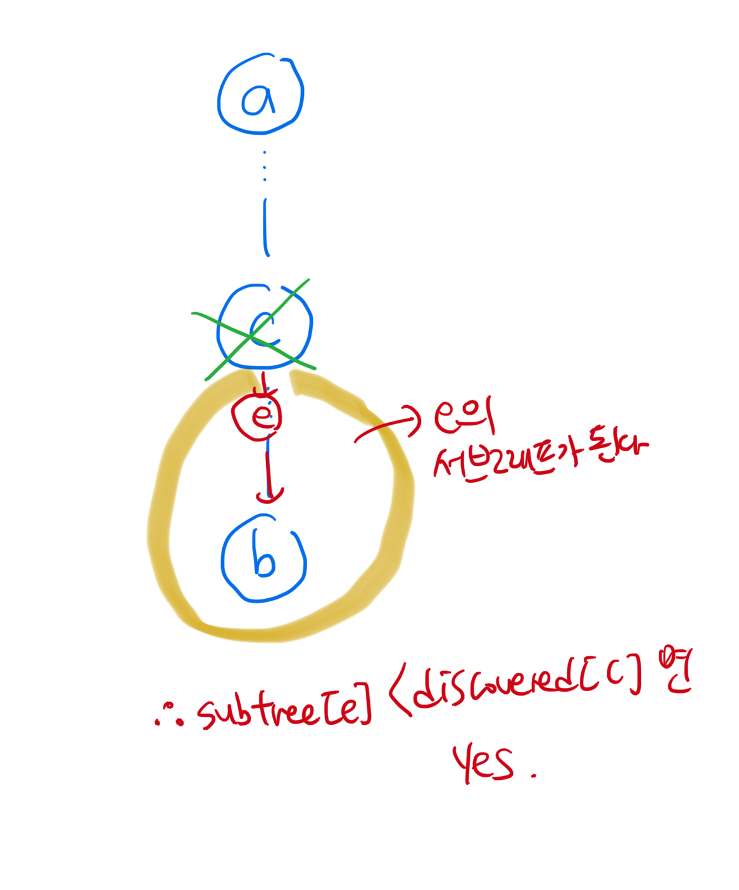

## 간선의 분류 

절단점과 절단선을 구분하기 위해 먼저 그래프에서 간선을 분류해보자. 

### 스패닝 트리 

그래프에서 한 정점을 깊이 우선 탐색했을 때, 탐색이 따라간 간선들만 모아서 보면 트리 형태를 띄는 것을 알 수 있다. 이를 `스패닝 트리` 라고 부른다. 


### 간선의 분류 

이렇게 스패닝 트리를 만들면 그래프의 모든 간선을 네 가지로 분류할 수 있다. 

1. Tree edge: 스패닝 트리에 포함된 간선 
2. forward edge: 스패닝 트리의 선조에서 자손으로 연결되지만 트리 간선은 아닌 간선 
3. back edge: 스패닝 트리의 자손에서 선조로 연결되는 간선 
4. cross edge: 위 세가지 분류에 속하지 않는 간선 

그렇다면 어떻게 분류할 수 있을까? 

1. Tree edge

   ```
   dfs(u)내에서 간선 (u, v)를 검사했을 때, v가 방문된 적이 없다면 (u, v)는 트리 간선이다. 
   ```

2. 나머지 edge

   ```
   dfs(u)내에서 간선 (u, v)를 검사했을 때, v가 이미 방문되었다면 v가 u의 부모인지, 자손인지, 둘 다 아닌지 알 수 없다. 
   따라서 방문 순서를 기록하도록 discovered를 구성해야 한다. 
   이때, 
   1) (u, v)가 forward edge라면 v는 u의 자손이어야 하므로, discovered[v] > discovered[u]
   2) (u, v)가 back edge라면 v는 u의 선조이므로, discovered[v] < discovered[u]
   3) (u, v)가 cross edge라면 dfs(v)가 종료한 후 dfs(u)가 호출되어야 하므로 discovered[v] < discovered[u] 
   
   근데 여기서 문제점은 back과 cross를 구별할 수 가 없다. 따라서 finished라는 배열을 추가로 두어 dfs(v)의 종료 여부를 기록하여 둘을 구분한다. 
   ```

#### code 

```cpp
vector<vector<int>> adj; 
vector<int> discovered, finished; 
int counter = 0;
void dfs(int here) {
  discovored[here] = counter++; 
  for(auto &there:adj[here]) {
    if(discovered[there] == -1) {
      cout << "tree edge" <<endl; 
      dfs(there);
    } else {
      if(discovered[here] < discovered[there])
        cout << "forward edge" << endl;
      else {
        if(!finished[there])
          cout << "back edge" << endl;
        else 
          cout << "cross edge" << endl;
      }
    }
  }
  finished[here] = true; 
}
```


## 절단점과 절단선 

> 여기서는 모든 그래프를 무방향 그래프라고 가정합니다. 
>
> 기억하세요! 무향그래프는 cross edge를 가지지 않습니다. 

### 절단점 

가장 간단하게 찾는 방법은 해당 정점을 그래프에서 삭제한 뒤 컴포넌트 개수가 이전보다 늘어났는지를 확인하는 것이다. 하지만 모든 정점에 대해 이 방법을 사용하면 dfs를 |V|번 수행하게 되어 성능이 매우 안좋다. 

위에 소개했던 간선의 분류를 통해 한 번의 dfs로 절단점을 찾을 수 있다. 어떻게? 



u를 제거했을 때 그래프가 분할될지 어떻게 알 수 있을까 u를 지웠을 때 u의 자손들 (그림에서 v1, v2, v3)가 u의 부모(p)와 연결되는지 확인하면 된다. 즉, u의 자손들이 `역방향 간선을 통해 u의 부모로 갈 수 있는지`를 파악하면 된다. 

가장 쉽게 확인하는 방법은 `u` 의 서브트리에서 역방향 간선을 통해 갈 수 있는 정점의 최소 깊이를 반환하는 것이다. 만약 `u` 의 자손들이 모두 역방향 간선을 통해 `u` 의 선조로 올라갈 수 있다면 `u` 는 절단점이 아니다. 

```cpp
vector<vector<int>> adj; 
vector<int> discovered;
vector<bool> isCutVertex;
int counter = 0; 

int dfs(int here, bool isRoot) {
  discovered[here] = counter++; 
  int earliestByBackEdge = discovered[here];
  int child = 0;
  for(auto &there:adj[here]) {
    if(discovered[here] == -1) {
      child++;
      int subtree = dfs(there, false);
      if(!isRoot && subtree >= discovered[here]) {
        isCutVertex[here] = true;
      }
      earliestByBackEdge = min(earliestByBackEdge, subtree);
    } else {
      earliestByBackEdge = min(earliestByBackEdge, discovered[there]);
    }
  }
  if(isRoot) 
 		isCutVertex[here] = (child>=2);
  return earliestByBackEdge; 
}
```



### 절단선 

> Bridge라고 부르며, 제거되었을 때 그래프의 컴포넌트 개수가 증가하게 되는 간선을 의미한다. 

DFS로 절단선을 찾을 수 있다. 어떻게! 

가장 먼저 파악해야하는 점은 절단선은 무조건 `Tree edge`라는 것이다. 그 이유는 forward edge나 back edge가 있다는 것은 `tree edge` 가 존재한다는 의미이고 그러면 (u, v)를 연결하는 또 다른 간선이 있다는 의미이기 때문이다. 

그럼 이제 문제는 다음과 같다. 

> Tree edge에서 어떤 특성이 Bridge일까? 

단절점과 유사하다. (u, v)를 봤을 때 u에서 부모로 가는 간선을 제외하고 (왜 제외해야하는지는 의문), 

v의 subtree가 갈수있는 가장 위의 정점과 비교하여 더 크다면 bridge가 된다. 

```cpp
vector<vector<int>> adj;
vector<int> discovered; 
int counter = 0;

int dfs(int here, int parent = -1) {
  discovered[here] = counter++;
  int earliest = discovered[here];
  for(auto &there:adj[here]) {
    if (there == parent) // edge 여러개인 경우 무시 
      continue; 
    if (discovered[there]==-1) {
      int subtree = dfs(there, here);
      if (subtree > discovered[here])
        IS_BRIDGE(here, there); 
      earliest = min(earliest, subtree);
    } else {
      earliest = min(earliest, discovered[there]);
    }
  }
  return earliest;
}
```


## BOJ 1734 교통체계

### 풀이

> 진짜 어렵고 어렵다. 

핵심은 a, b가 도대체 어떤 서브 그래프에 속해있는가? 

1. `a, b, c, d` 

   (c, d)가 끊어졌을 때, 그래프가 두 부분으로 나뉘어지게 될 것이다. 이 때, a, b가 같은 서브그래프라면 문제 없다. 그런데 이걸 어떻게 판단할까? 

   V가 굉장히 크기 때문에 한 번의 dfs로 모든 정보를 저장해 두어야한다. 

   - 먼저 절단선인지 아닌지를 판단해보자. 

     ```
     c가 조상이라고 가정하고 
     1. depth[d]!=depth[c]+1 이면 c, d 사이에 다른 자손 x가 포함되어 있다는 소리이고, 이는 (c, d)가 끊어지더라도 (c, x, d)라는 다른 경로가 생기므로 절단선이 아니다. 
     2. subtree[d] < discovered[d] 이면 d의 자손이 back edge를 가진다는 소리이고 이는 (c, d)가 끊어지더라도 (c, x, d)로 연결될 수 있다. 
     ```

   - 절단선이 아닐 때, a, b가 어디로 속하게 되는지 파악해보자. 

     ```
     절단선이면 c편, d편으로 나누이진다. 따라서 둘의 조상이 같기만하면 (a, b)는 끊어지지 않는다. 
     ```

   - 위의 경우가 아니라면 (a, b)는 끊어진다. 

2. `a, b, c` 

   정점 c를 제거했을 때 c가 절단점이라면 그래프가 두 개 이상으로 나누어질 것이다. 절단점인지 아닌지 파악하기 전에 a와 b가 c의 조상이라면 c 가 없어도 아무 일도 없다. 

   ```
   1. !is_descendant(a, c) && !is_descendant(b, c) 
   2. is_descendant(a, c) && is_descendant(b, c) 
     -> 어디에 속하게 될지 파악하자 
     1) e=find_related_child(c, a) == f=find_related_child(c, b) 
     -> 같은 부분에 속하므로 문제가 없다. 
     2) subtree[e] < discovered[c] && subtree[f] < discovered[c] 
     -> 둘 다 c위의 조상들과 연결되므로 문제가 없다. 
     3) 끊어진다. 
   3. 위의 경우를 모두 제외하고 다른 경우가 있다. 하나는 c의 조상, 하나는 c의 자손일 경우이다. 밑의 그림을 보면 쉽게 이해할 수 있다. 
   ```

   

