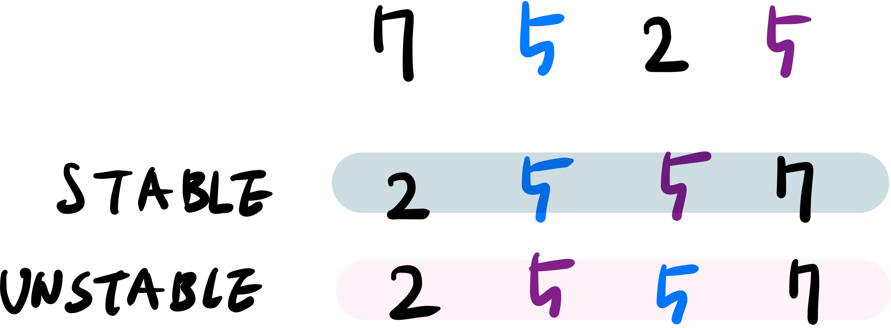
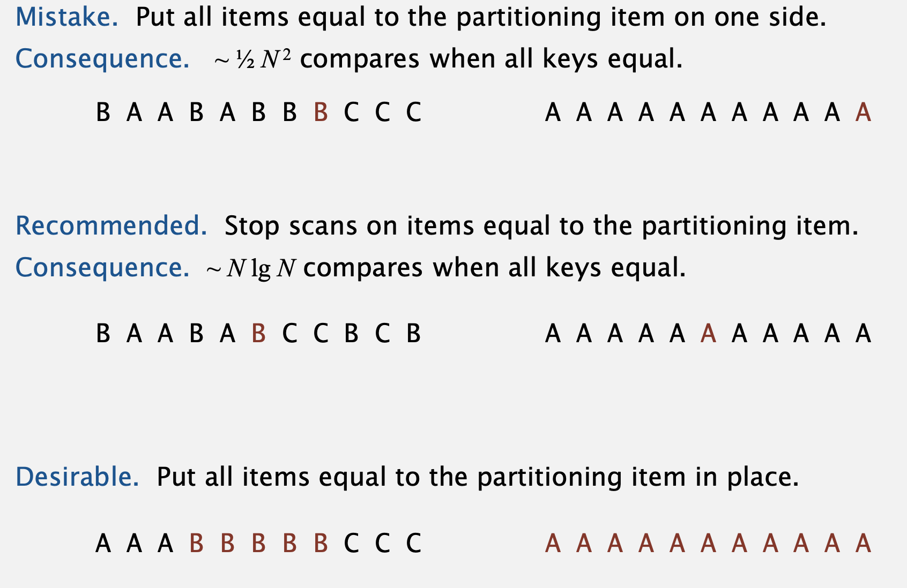
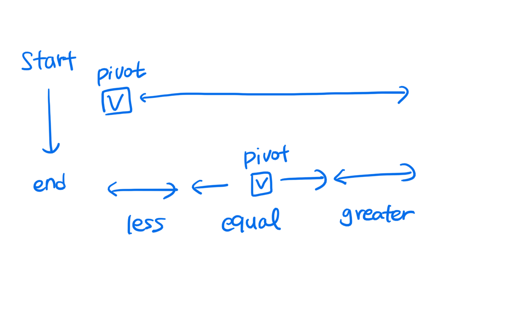

## Stable vs. Unstable 

> 도대체 Stable이 뭐야? 

Stable sort는 반복된 원소가 정렬되더라도 같은 순서대로 정렬되는 것을 뜻한다. 

무슨 의미냐면 이런 의미다. 




그렇다면 Stability가 왜 중요한걸까? 

여러가지 속성을 가진 튜플을 생각해보자. 첫 번째 속성으로 그 튜플이 이미 정렬 되어 있고, 이제 사용자는 두 번째 속성으로 그 튜플을 정렬하고 싶다. 근데~ 제자리 정렬이 아니면 `첫 번째 속성의 정렬이 깨져버리는 것이다.`

Stability가 되는 정렬의 조건은 무엇일까? 

> Insertion sort, merge sort는 Stable한 정렬이다. 다른 정렬이랑 뭐가 다르길래!

- `less than` vs `less than or equal to` 


## Sort for Linked List 

Linked List를 정렬하려면 Merge sort를 사용해야 한다. 그 이유는 `Linked list가 random access 불가능`이기 때문이다.

### Merge two sorted linked list 

```cpp
Node* merge(Node *a, Node *b) {
  Node *result = nullptr;
  if(a==nullptr)
    return b; 
  else if(b==nullptr) 
    return a; 
  if(a->data <= b->data) {
    result = a; 
    result -> next = merge(a->next, b);
  } else {
    result = b; 
    result -> next = merge(a, b->next);
  }
  return result;
}
```

재귀적인 방법으로 이미 정렬된 두 연결리스트를 merge할 수 있다. 


## Merge Sort 

> 폰 노이만에 의해 개발되었다. $NlogN$ 의 성능을 보장한다. 

분할정복에 기반한 정렬로 다음을 반복한다. 

1. 배열을 절반으로 쪼갠다. 
2. 각각을 재귀적으로 정렬한다. 
3. 두 배열을 합친다. (여기가 핵심!)

:smile: 두 정렬된 배열이 있을 때 어떻게 합칠 수 있을까? (ㅠㅠ)

> E!A!S!Y!

```cpp
void merge(vector<int>& a, vector<int>& aux, int lo, int mid, int hi) {
  // why copy needed? 
  for (int k=lo; k<=hi; ++k) {
    aux[k] = a[k];
  }
  int i = lo, j = mid+1; 
 	for(int k=lo; k<=hi; ++k) {
    if(i>mid) a[k] = aux[j++]; 
    else if (j>hi) a[k] = aux[i++];
    else if (aux[j]<aux[i]) a[k] = aux[j++];
    else a[k] = aux[i++];
  }
}

void mergeSort(vector<int>& a, vector<int>& aux, int lo, int hi) {
  if (hi<=lo) return; 
  int mid = (lo+hi)/2; 
  mergeSort(a, aux, lo, mid);
  mergeSort(a, aux, mid+1, hi);
  merge(a, aux, lo, mid, hi);
}
```

:smile: Merge sort는 정렬할 때 N 크기의 배열을 추가로 사용한다. 

위의 코드에서 aux 배열이 merge sort가 바로 그 추가로 사용하는 배열이다. 따라서 merge sort는 in-place sort가 아니다. merge sort는 in-place로 구현할 수도 있지만 너무 복잡하여 사용하지 않는다. 

### practical improvements

1. subarray가 충분히 작다면, 재귀의 오버헤드를 줄이기 위해 다른 정렬을 하자. 

   ```cpp
   void mergeSort(vector<int>& a, vector<int>& aux, int lo, int hi) {
     if (hi<=lo + CUTOFF - 1) {
       insertionSort(a, lo, hi);
       return; 
   	}
     int mid = (lo+hi)/2; 
     mergeSort(a, aux, lo, mid);
     mergeSort(a, aux, mid+1, hi);
     merge(a, aux, lo, mid, hi);
   }
   ```

   - CUTOFF는 7정도면 적당하다. 
   - 20%정도 빨라진다. 

2. 정렬이 되었다면 멈추자. 

   ```cpp
   void mergeSort(vector<int>& a, vector<int>& aux, int lo, int hi) {
     if (hi<=lo) return; 
     int mid = (lo+hi)/2; 
     mergeSort(a, aux, lo, mid);
     mergeSort(a, aux, mid+1, hi);
     if(a[mid+1]>=a[lo]) 
       return;
     merge(a, aux, lo, mid, hi);
   }
   ```

   - 두 번째 배열의 첫 번째 값이 첫 번째 배열의 첫 번째 값보다 크거나 같다면 굳이 merge를 할 필요가 없다. 

3. auxiliary array에 복사하는 과정을 제거하자. (시간은 절약하지만 공간을 절약하는 것은 아님에 주의)

   ```cpp
   void merge(vector<int>& a, vector<int>& aux, int lo, int mid, int hi) {
     int i = lo, j = mid+1; 
    	for(int k=lo; k<=hi; ++k) {
       if(i>mid) a[k] = aux[j++]; 
       else if (j>hi) a[k] = aux[i++];
       else if (aux[j]<aux[i]) a[k] = aux[j++];
       else a[k] = aux[i++];
     }
   }
   
   void mergeSort(vector<int>& a, vector<int>& aux, int lo, int hi) {
     if (hi<=lo) return; 
     int mid = (lo+hi)/2; 
     mergeSort(aux, a, lo, mid);
     mergeSort(aux, a, mid+1, hi);
     merge(a, aux, lo, mid, hi);
   }
   ```

   - a와 aux를 바꿔가면서 한다. 

### Bottom-up mergesort 

1. array를 순회하면서 먼저 크기가 1인 서브어레이들을 합친다. 
2. 이걸 크기 2, 4, 8, 16, ... 으로 반복한다. 

> No recursion!!! 

```cpp
void merge(vector<int>& a, int lo, int mid, int hi) {
  ...
}

void mergeSort(vector<int>& a) {
  int N = a.size(); 
  vector<int> aux(N); 
  for(int sz=1; sz<N; sz+=sz) {
    for(int lo=0; lo<N-sz; lo+=2*sz) {
      merge(a, lo, lo+sz-1, min(lo+2*sz-1, N-1));
    }
  }
}
```


## Quick Sort 

> 대부분의 시스템에서 사용되고 있는 알고리즘으로 1980년에 개발되었다. 

1. Partition! 
   - a[j]를 기준으로
   - j의 왼쪽에는 a[j]보다 작은 원소를 
   - j의 오른쪽에는 a[j]보다 큰 원소를 놓는다. 
2. 재귀적으로 정렬한다. 

잘 생각해보면 partition인 a[j]는 parition 과정에서 자기 자리를 찾게 된다. 

### :star: Partitioning :star:

1. `i` 와 `j` 가 엇갈릴 때까지 반복한다. 
   - `a[lo]` 보다 큰 원소가 나올 때까지 `i++` 
   - `a[lo]` 보다 작은 원소가 나올 때까지 `j++` 
   - `i>=j` 가 아니라면 `swap(a[i], a[j])` 

```cpp
int partition(vector<int> &a, int lo, int hi) {
  int i = lo, j = hi+1;
  while(true) {
    while(a[++i] < a[lo])
      if(i == hi) break; 
    while(a[lo] < a[--j])
      if(j == lo) break; 
    if(i>=j) break; 
    swap(a[i], a[j]);
  }
  swap(a[lo], a[j]);
  return j;
}
```

### Sort 

partition을 기준으로 left와 right를 정렬한다. 

```cpp
void sort(vector<int> &a, int lo, int hi) {
  if(hi<=lo) return; 
  int j = partition(a, lo, hi);
  sort(a, lo, j-1);
  sort(a, j+1, hi);
  // 이미 a[j]는 자기 자리를 찾았으므로 lo~j-1과 j+1~hi를 정렬한다. 
}
```

:smile: 퀵소트의 최대 장점 

: in-place 정렬이다. 즉, 정렬을 위한 추가 공간이 필요하지 않다. 

### Quick sort에서 고려해야할 점 

1. Partitioning in-place 

   : 추가 공간을 사용해서 partitioning을 쉽고 이를 통해, stable한 정렬을 할 수도 있지만 퀵소트를 사용하는 이유는 제자리정렬이라는 점이 크기 때문에 굳이

2. Terminatin the loop 

   : 언제 loop가 끝나는지 주의 깊게 봐야함 (특히 중복된 키가 존재할 때)

3. Staying in bounds

4. Preserving randomness

5. Equal keys 

   : 중복 키가 존재할 때 주의할 점들이 있음 (추후에 설명)

:question: 퀵소트가 머지소트보다 빠르기 때문에 주로 사용된다. 그렇다면 왜 빠를까? 

>  증명과정은 생략했지만 비교 횟수가 퀵소트보다 머지소트가 더 많다. 그런데 왜 빠르지? 이는 머지 소트는 값의 복사 과정의 비용때문에 퀵 소트보다 느리다. 

### practical improvements 

1. subarray가 충분히 작다면 insertion sort 한다. 

   - n = 10 정도면 insertion sort로 처리하자. 
   - 20%정도 빠르다. 

2. Median of sample 

   - 좋은 pivot을 고르기 위한 방법이다 
   - 표본의 median을 취하여 실제 median을 추정한다. 
   - sample의 크기를 3으로 하는 방법이 사용된다. `median(a[lo], a[mid], a[hi])` 

   ```cpp 
   void sort(vector<int> &a, int lo, int hi) {
     if(hi<=lo) return;
     int m = median(a[lo], a[(lo+hi)/2], a[hi]);
     swap(a[lo], a[m]);
   	int j = partition(a, lo, hi);
     sort(a, lo, j-1);
     sort(a, j+1, hi);
   }
   ```


### Selection 

>  N개의 항목에서 k번째로 큰 수를 찾아라

- $NlogN$ 에 구하자 $\rightarrow $ 정렬하면 끝 
- $k=1,2,3$ 이라면 $N$ 에 구하자 $\rightarrow$ N * K 이기 때문에 K가 작으면 매우 쉬움 
- $N$ 에 구하자 :frowning: ! 이제 설명해보겠음 

이 문제는 60~70년대에 활발하게 논의되었던 주제이다. 

#### Quick-select 

> Hoare는 1961년 partitioning에 기반한 해결책을 제안하였다. 

partition의 특징에 기반한다. 

- `a[j]` 는 자기 자리에 있다. 

```cpp
int select(vector<int> &a, int k) {
  int lo = 0, hi = a.size() - 1; 
  while(lo<hi) {
    int j = partition(a, lo, hi); 
    if(j<k) lo = j+1;
    else if(j>k) hi = j-1; 
    else return k; 
  }
  return a[k];
}
```


### Duplicate key 

> quicksort에서 중복키가 많으면 어떡하지? 

mergesort는 배열을 정확히 절반으로 나누기때문에 이런 현상이 발생하지 않는다. 하지만 quicksort는 중복 키가 많을 때 중복 키에 대해 파티셔닝을 중단하지 않으면 성능이 $N^2$ 이 된다. 1990년 C 사용자가 `qsort()` 에서 이 문제점을 발견하였다. 왜 그럴까? 

> [Coursera Alogorithm](https://www.coursera.org/learn/algorithms-part1/lecture/XvjPd/duplicate-keys)




첫 번째 문제점은 

#### 3-way partitioning

> 선택된 pivot을 기준으로 중복값을 가운데, 작은값을 왼쪽, 큰 값을 오른쪽으로 두는 방법. 



위와 같이 파티셔닝한다. 이렇게 했을 때 좋은 점은 뭘까... 

1990년대까지는 이 방법이 그렇게 효율적이라고 생각하지 않았다. 그러나 다익스트라가 [Dutch national flag promblem](https://en.wikipedia.org/wiki/Dutch_national_flag_problem)을 고안하면서 3-way partitioning을 $O(n)$ 의 비용으로 할 수 있게 되었다. 

:smile: pseudo code 

```
1. a[lo]의 값 v를 pivot으로 삼는다. 
2. 왼쪽에서 오른쪽으로 i를 스캔하자. 
    - if (a[i] < v): swap(a[lt], a[i]) and lt++; i++; 
    - if (a[i] > v): swap(a[gt], a[i]) and gt--; 
    - if (a[i] == v): i++;
```

:smile: code 

```cpp
void sort(vector<int> &a, int lo, int hi) {
  if(hi<=lo)
    return; 
  int lt = lo, gt = hi; 
  int v = a[lo];
  int i = lo; 
  while(i<=gt) {
    if(a[i] < v) {
      swap(a[lt], a[i]); 
      lt++; i++;
    } else if (a[i] > v) {
      swap(a[gt], a[i]); 
      gt--;
    }
  }
  sort(a, lo, lt-1);
  sort(a, gt+1, hi);
}
```


## System sort 

:question: JAVA에서 sort는 quickSort or mergeSort? 

> Array.sort()는 primitive type에 대해서는 quicksort를 사용하고, object에 대해서는 mergesort를 사용한다. 왜 다른 방식을 사용할까? 그 이유는 1. stability 2. $nlogn$ 보장 이다. 

System sort는 대부분 `quick sort` 를 기본 알고리즘으로 사용한다. 그리고 다음과 같은 최적화를 추가로 해준다. 

- cutoff to insertion sort for small arrays 
- 3-way partitioning 
- partitioning item (pivot)
  - small arrays: middle entry 
  - medium arrays: median of 3
  - large arrays: Tukey's ninther 

### Tukey's ninther 

> Median of the median of 3 samples, each of 3 entries 

- 크기 9의 중앙값을 근사한다. 
- 최대 12번의 비교를 한다.


> 랜덤이 아닌 배열에 대해 퀵소트는 $NlogN$ 의 성능을 보장할 수 없다. 따라서 정렬 전에 보통 random shuffling을 진행한다. (진짠가?)

## Radix Sort 

