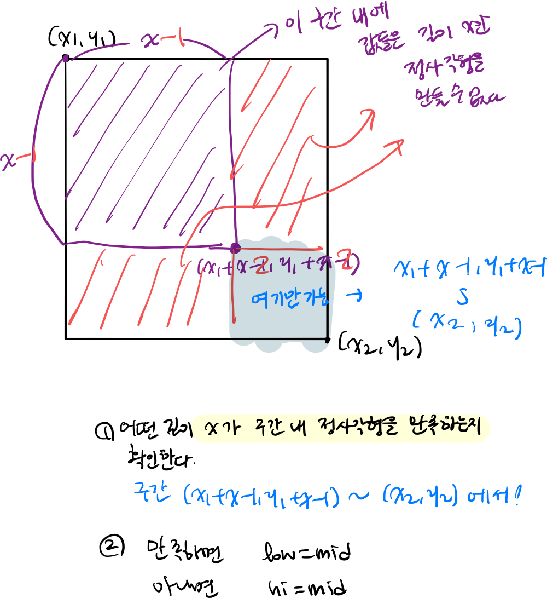

## 문제 

> https://codeforces.com/contest/713/problem/D

## 풀이 

> https://codeforces.com/blog/entry/47094

Editorial을 보면 문제의 핵심을 3가지로 요약할 수 있다. 

### 1. DP 

어떤 구간에서 정사각형의 최대 길이를 어떻게 알 수 있을까?

임의의 구간을 생각하기 전에 먼저 한 점이 고정된 구간을 생각해보자. 2차원 배열에서 `A[i][j]` 를 포함하는 (여기서 포함한다는 뜻은 무조건 `A[i][j]` 가 1이어야 함을 뜻한다) 최대 정사각형의 길이는 다음의 식으로 표현할 수 있다. 

$dp[i][j] = min(dp[i-1][j], dp[i][j-1], dp[i-1][j-1]) + 1$ 


### 2. Sparse Table

이제 DP에서 구한 값을 이용하여 Sparset Table `st` 를 구성하자. 

1) 2d sparse table 구하기 

```cpp 
 for (int i = 0; i < LOGN; ++i) {
        for (int j = 0; j < LOGN; ++j) {
            for (int r = 0; r + (1 << i) <= n; ++r) {
                for (int c = 0; c + (1 << j) <= m; ++c) {
                    if (i == 0 && j == 0)
                        continue;
                    if (i == 0) {
                        st[r][c][i][j] = max(st[r][c][i][j - 1], st[r][c + (1 << (j - 1))][i][j - 1]);
                    } else if (j == 0) {
                        st[r][c][i][j] = max(st[r][c][i - 1][j], st[r + (1 << (i - 1))][c][i - 1][j]);
                    } else {
                        st[r][c][i][j] = max({st[r][c][i - 1][j - 1], st[r + (1 << (i - 1))][c][i - 1][j - 1],
                                              st[r][c + (1 << (j - 1))][i - 1][j - 1],
                                              st[r + (1 << (i - 1))][c + (1 << (j - 1))][i - 1][j - 1]});
                    }
                }
            }
        }
    }
```

2) `query(l, r)` 

```cpp
int query(int x1, int y1, int x2, int y2) {
    int dist1 = LOG[x2 - x1 + 1], dist2 = LOG[y2 - y1 + 1];
    return max({st[x1][y1][dist1][dist2], st[x2 - (1 << dist1) + 1][y1][dist1][dist2],
                st[x1][y2-(1<<dist2)+1][dist1][dist2], st[x2-(1<<dist1)+1][y2-(1<<dist2)+1][dist1][dist2]});
}
```


### 3. Binary Search

마지막 단계인 이분 탐색이다. 이제 주어진 쿼리에 대해서 구간 내에 가장 큰 정사각형의 길이를 반환해아한다. 

어떻게? 앞에서 구한 것으로 다 해결되었다. 



```cpp
int binarySearch(int x1, int y1, int x2, int y2) {
    int low = 0, high = min(x2 - x1 + 1, y2 - y1 + 1);
    int ans = 0;
    while (low <= high) {
        int mid = (low + high) / 2;
        if (compute(x1, y1, x2, y2, mid)) {
            ans = mid;
            low = mid + 1;
        } else
            high = mid - 1;
    }
    return ans;
}
```

