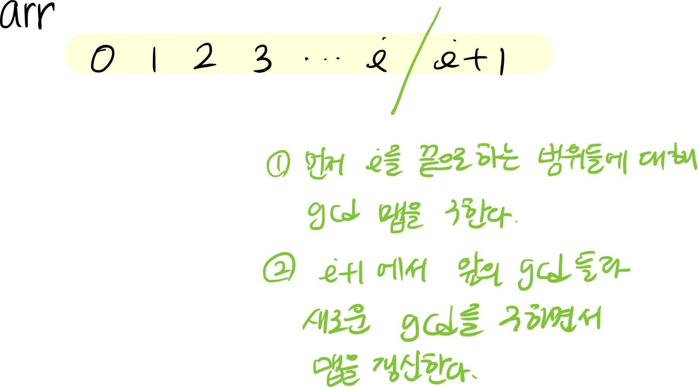

## 문제 


## 풀이 

### gcd의 성질 

기본적으로 gcd는 값이 추가될수록 무조건 작아진다. 왜? 당연히! 당연히!

$x_i = \text{arr[i]를 마지막으로 하는 gcd 라고 하면 } x_i\le x_{i-1}$

### gcd의 갯수가 굉장히 빠른 속도로 줄어든다는 것 

:thinking: how to prove! 

```

```


### 생각하지 못했던 점 

left를 고정해야 할 게 아니라 right를 고정하면 생각이 쉬워진다. 



```cpp
map<int, long long> prev, cur; 
// prev는 index를 끝으로 하는 모든 범위에서 가지는 각 gcd의 개수 
// cur은 중간에 prev가 갱신되면 loop가 제대로 동작이 안되기 때문에 있는 값 
for(int i=0; i<N; ++i) {
  cur.clear();
  cur[arr[i]]++;
  for(auto &p:prev) {
    int g = gcd(p.first, arr[i]);
    cur[g] += p.second;
  }
}
```


