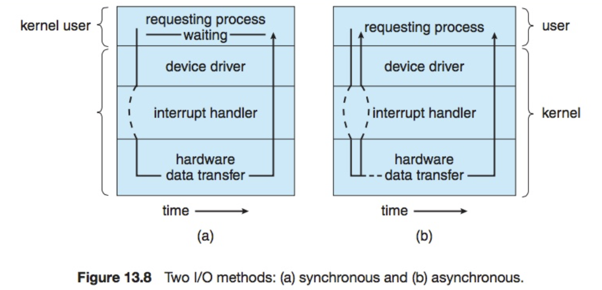

> 도대체 넷의 차이가 무엇일까? 

[잘 설명된 slide](https://www.slideshare.net/unitimes/sync-asyncblockingnonblockingio)

### Blocking vs. Nonblocking

공룡책이 말하기를

> *Blocking system call*
>
> When an application issues a blocking `system call`, the execution is suspended. The application is moved from the operation system's `run queue` to a `wait queue` . After the system call completes, the application is moved back to the run queue. 
>
> *Non-blocking system call*
>
> A nonblocking `system call` does not halt the execution of the application for an extended time. Instead, it `returns quickly, with a return value` that indicates how many bytes were transffered. 

### Asynchronous vs. Nonblocking 

공룡책이 말하기를 

> *Asynchronous system call*
>
> An `alternative` to a nonblocking system call is an asynchronous system call. An asynchronous call `returns immediately, without waiting` for the I/O to complete. 
>
> *Difference*
>
> The difference between nonblocking and asynchronous system calls is that a nonblocking read() returns immediately `with whatever data are available` - the full number of bytes requested, fewer, or none at all. 
>
> An asynchronous read() call requestes a transfer that will be performed in `its entirety` but will complete `at some future time` 

### Synchronous vs. Asynchronous

공룡책이 말하기를 

> 

시스템 콜의 완료를 기다리면 synchronous, 기다리지 않으면 asynchronous. 

### Synchronous vs. blocking 

Stackoverflow가 말하기를 

> Synchronous means an activity that `must wait for a reply` before the thread can move forward. `Blocking` refers to the fact that the thread is `placed in a wait state` . A synchronous call may involved blocking behavior or may not, depending on the underlying implementation(i.e. it may also be spinning, meaning that you are simulation synchronous behavior with asynchronous calls).

시스템콜의 리턴을 기다리는 동안 대기 큐에 머문다면 Blocking, 아니라면 synchronous. 

