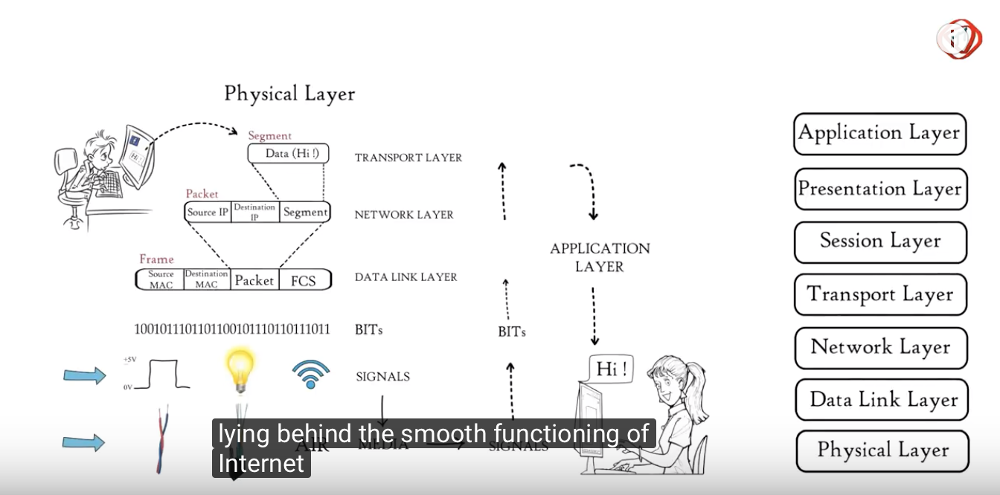
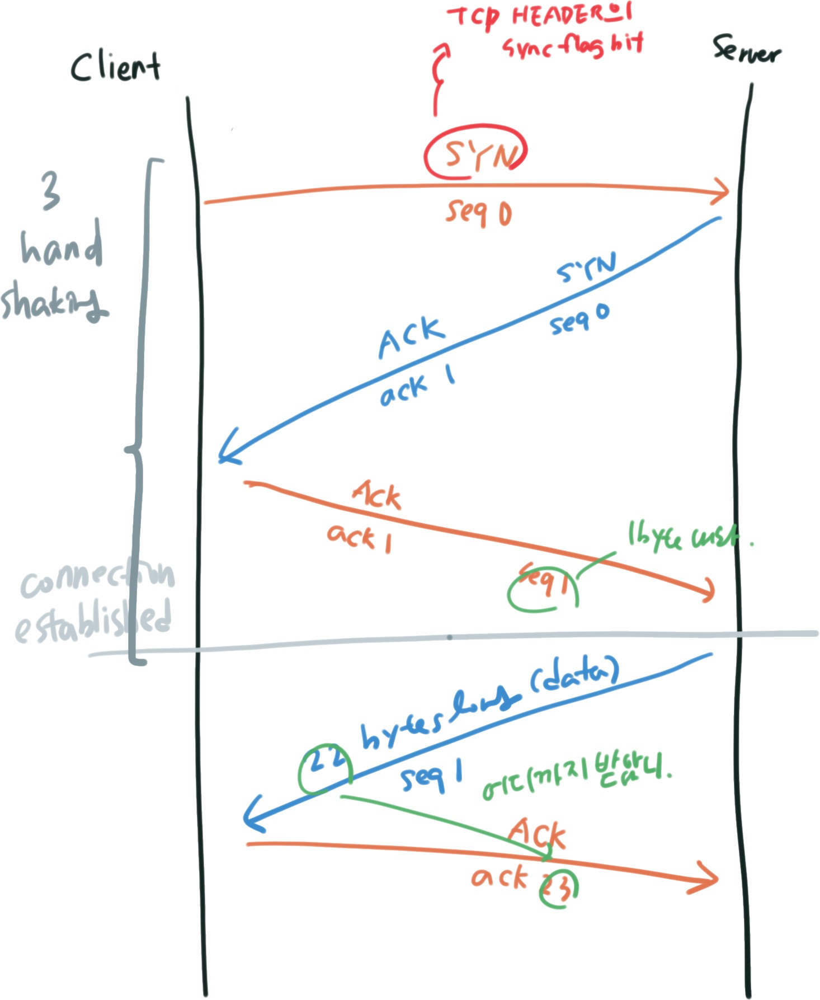

## OSI 7 계층 

> https://youtu.be/vv4y_uOneC0
>
> 설명이 좋은 유튜브에서 참고한 그림! 

## TCP 3\-way\-handshake 

TCP는 Transport Layer 이다. Transport Layer에서 하는 일은 

1. 오류 검출 및 복구
2. 흐름제어 (flow control)

TCP에서 3\-way\-handshake는 `connection establishment` 에서 행해지는 방식이다. 

TCP는 `connection establish` 에서 3개의 패킷을 주고 받게 된다. 

> Why 3-hand-shaking? 
>
> https://networkengineering.stackexchange.com/questions/24068/why-do-we-need-a-3-way-handshake-why-not-just-2-way
>
> 2-handshake는 ISN(Initia	ql Sequence Number)를 한 부분만 설정할 수 있기 때문에 단방향일 때만 가능하다. TCP는 양방향 프로토콜이기 때문에 둘 다 ISN을 설정할 수 있어야 한다. 왜냐면 둘 다 서로의 `ISN`을 알아야 양방향으로 전송할 수 있기 때문이다. 
>
> 그렇다면 `ISN`이 왜 필요해? 이는 도착 순서가 다를 수 도 있기 때문에, 그리고 데이터가 누락됐을 때 재전송도 해줘야하니까. 

