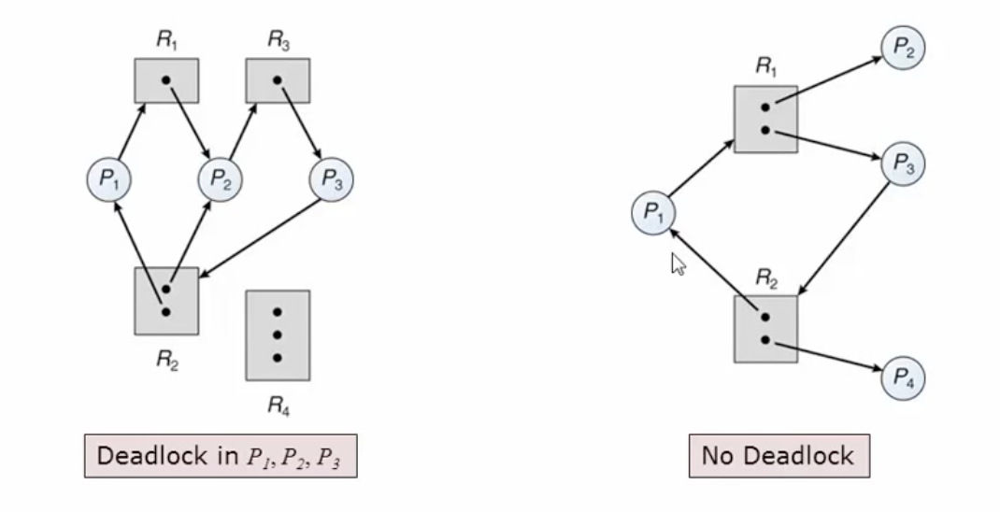

---

title: 운영체제3
date: 2019-10-01 19:09:46
category: tech
---

> 참고 링크 
>
> [1](https://twinw.tistory.com/4)

## Sync vs. Async vs. Blocking vs. Non-Blocking

> https://www.slideshare.net/unitimes/sync-asyncblockingnonblockingio
>
> https://evan-moon.github.io/2019/09/19/sync-async-blocking-non-blocking/

> 대기 큐 (waiting queue)
>
> : 여러 이벤트에 대한 조건부로 대기를 구현하고 표현. 특정 이벤트를 기다리는 프로세스는 적절한 대기 큐에 자기 자신을 넣고 CPU 제어를 포기. 근데 왜 Blocking이 대기 큐로 보낸다는데 cpu자원을 소모하지???????

### Blocking vs. non-blocking

> Blocking 
>
> 한 어플리케이션(or thread)이 시스템 콜로인해 블락되면 어플리케이션의 실행은 중단(suspended)된다. 

### Sync vs. Async

동기는 기다리는 것. 비동기는 기다리지 않는 것. 

그래서 동기는 순차적인 흐름이 보장된다. 

### non-blocking vs. asynchronous

시스템 콜이 반환될 때 실행된 결과(데이터)와 함께 반환되는 경우는 non-blockinig

시스템 콜이 반환될 때 실행된 결과(데이터)와 함께 반환되지 않는 경우는 asynchronous


### 참고.

> [blocking io와 waiting queue](https://knight76.tistory.com/entry/공부-blocking-io-와-waiting-queue)


## 프로세스 동기화 

### 유저모드 동기화와 커널모드 동기화 

> https://stackoverflow.com/questions/36679666/user-mode-synchronization-vs-kernel-mode-synchronization-in-linux-and-windows
>
> 기본적으로 프로세스는 유저모드로 실행된다. 프로세스가 하드디스크나 네트워크 연결처럼 시스템에서 모든 프로세스가 공유하고 있는 자원이 필요할때가 있다. 또 우선순위를 바꾸고 싶을 수 도 있다. 이럴 때 프로세스는 운영체제의 도움을 필요로 하게 되는 것이다. 그러면 어떠한 메커니즘에 의해 유저모드에서 커널모드로 전환이되고 이러한 operation(공유 자원 사용, 우선순위 변경 등)을 하게 되는 것이다. 이런 operation 중 하나가 동기화이다. 

동기화를 하는 과정에서 커널의 자원을 이용하면 유저모드 동기화이다. 커널모드로 전환이 이루어지지 않기 때문에 성능상이 이점이 있다. 

커널모드 동기화는 커널의 자원을 이용하여 성능 저하가 발생하지만 커널모드에서 제공하는 기능을 사용할 수 있다. 

### Race Conditoin

```cpp
/*counter++*/
register1 = counter
register2 = register1 + 1
counter = register1
```

한 명령어가 사실 한 번에 이루어지는 연산이 아니기 때문에 경쟁조건이 발생한다. 

### Critical Section

멀티 스레드 문제점에서 나오듯, 동일한 자원을 동시에 접근하는 작업을 실행하는 *코드 영역* 이다. 이 영역은 한 번에 한 프로세스만 실행할 수 있다. 

임계구역 문제를 해결하기 위한 3가지 조건이 있다. 

1. Mutual Exclusion
2. Progress
3. Bounded Waiting

> 근데 이게 유저모드 동기화인가? 그냥 코드영역을 저렇게 부른는거 아닌가.... 아 너무 헷갈려... 찾아보니까 윈도우에서 제공하는 ciritical section이라는 객체가 있어서 이렇게 설명되어 있던 것 같다. 신경쓰지 말자.

보통 다음과 같이 구성된다 

```
do {
	entry section 
		critical section
	exit section
		remainder section
} while(true)
```

#### Peterson's Solution 

> 프로세스가 2개인 경우에만 사용가능하다. 
>
> 하드웨어 레벨에서는 필요하지 않다. 


```cpp
do {
  flag[i] = true;
  turn = j;
  while(flag[j] && turn == j);
  /* critical section*/
  flag[i] = false;
  /* remainder section */
} while(true);
```


### Synchronization Hardware

대부분의 시스템은 하드웨어적으로 임계영역 코드 구현을 지원한다. 여기서도 Lock을 기반으로 한 아이디어! 

현대 기계들은 `atomic hardware instruction` 을 제공하며 `atomic = non-interruptible`

```
do {
	acquire lock
		critical section
	release lock
		remainder section
}
```

#### test_and_set 

```cpp
boolean test_and_set(boolean *target) {
  boolean rv = *target; 
  *target = TRUE
  return rv;
}
```

1. Executed atomically
2. Retruns the original value of passed parameter;
3. Set the new value of passed parameter to "TRUE"

이 연산 자체를 인터럽트 없이 실행하도록 하드웨어가 지원한다. 

#### compare_and_swap


### Mutex

하드웨어적인 해결책들은 너무 복잡해 그리고 어플리케이션 프로그래머들은 접근할 수가 없다. 그래서 OS 디자이너는 임계영역 문제를 해결하기 위해 소프트웨어적인 도구를 만든다. 그 중 가장 간단한 것이 바로 mutex lock.

임계영역을 보호하기 위해 먼저 `acquire` 로 락을 획득하고 `release` 로 락을 반환한다. `acquire` 과 `release` 호출은 반드시 atomic해야 한다. 보통 `atomic hardware instruction` 으로 이미 구현되어 있다. 

그러나 이 방법은 `busy waiting` 문제가 있다. 그래서 spin lock이라고 불리기도 함~

> 왜 이런방법을 사용했을까? 조금만 기다리면 바로 쓸 수 있는데 굳이 컨텍스트 스위칭으로 부하를 줄 필요가 없기 때문에. 
>
> 뒤에 busy waiting을 해결한 것도 소개하겠음.

```cpp
acquire() {
  while(!available)
    ; /*busy waiting*/
  availabe = false;
}

relase() {
  available = true;
}

do {
  acquire lock
    critical section
  release section
    remainder section
} while(true);
```

저 lock이 mutex lock이고 이것을 OS 레벨에서 지원해 주는 것이라고 이해하면 되는 거겠지... :disappointed:

그럼 acquire도 release도 지원을 이미 해주는건대 근데 os가 ... 기다리는 도중에 자원 뺏어야ㅑ되는거아닌가 다른애가 lock 놔줄라면 ... 인터럽이 무조건 되어야되는거 아니야???????? 그리고 pthread_mutex는 busy waitnig 안함 

그냥 간단하게 하면 이런식으로 된다고 이해하자 

### Semaphore

`semaphore` 는 정수이다. 진짜 그냥 일반적인 정수 타입 변수이다. 그런데 이 변수에는 두 오퍼레이션(atomic)을 통해서만 접근가능하다.

- `wait()` and `signal()`  = `P()` and `V()`

```cpp
wait(S) {
  while (S<=0)
    ; //busy wait
  S--;
}

signal(S) {
  s++;
}
```

세마포어를 구현하는 것은 다음과 같다. 

반드시 같은 세마포어에 대한  `wait` 와 `signal` 는 한 번에 한 프로세스만 실행해야 한다. 그러므로 이 구현은 임계영역 문제가 되는 것이고 `wait` 와 `signal` 은 임계영역에 있어야 한다. 

#### no Busy Waiting 

1. 세마포어는 대기큐가 있다. 
2. 대기 큐의 원소는 두 데이터를 가지고 있다. 
   - value (of type integer)
   - pointer to next record in the list 
3. 두 오퍼레이션 
   - block - 대기 큐(waiting queue)에 프로세스를 갖다 넣음 
   - wakeup - 대기큐에서 프로세스를 꺼내서 ready queue에 갖다 넣음 

```cpp
typedef struct {
  int value;
  struct process *list;
} semaphore;

wait(semaphore *S) {
  S->value--;
  if(S->value < 0) {
    add this process to S->list;
    block();
  }
}

signal(semaphore *S) {
  S->value++;
  if(S->value <=0) {
    remove a process P from s->list;
    wakeup(P);
  }
}
```


### Monitor

고레벨 추상화로 편리하고 효율적인 프로세스 동기화를 제공한다. 언어레벨(보통 객체지향언어들에서 `synchronized`)에서 지원한다. 

모니터 안에서 항상 하나의 프로세스만 활성화됨을 보장하기 때문에 (상호 배제) 동기화 제약 조건을 명시적으로 코딩할 필요가 없다. 


### 조건 변수 (condition variable)

동기화의 응용 사례로 조건에 따라 모니터 안에서 프로세스의 진행을 통제한다. 

이는 임계구역 보호와는 다른 동기화 목적을 가진 것으로 어떤 조건의 발생을 대기하여 동기화를 한다. 그 이유는 모니터 자체의 상호 배제 만으로는 프로그래머가 원하는 동기화를 구현하는 것이 불충분하기 때문이다. 

세마포어와 유사한 동기화 연산 기능을 한다. 

- `x.wait()` 
- `x.signal()` 

하지만 조건 변수는 세마포어와는 좀 다르다. 세마포어는 `wait()`를 처음 호출한 프로세스라면 자신이 lock을 걸고 임계영역으로 진입하지만 세마포어는 명시적인 `signal` 이 있어야 블록이 해제된다. 

주의해야할 점은 모니터에 한정된 기법이 아니라는 것으로 다른 동기화 방법에도 사용된다. ex. `pthread_cond_t` 

#### 모니터 안에서 조건 변수을 사용할 때 주의할 점 

`x.signal()` 호출로 인해 모니터 안에서 두 개의 프로세스가 활성화 될 수 있다. 이는 모니터의 상호 배제 규칙에 위반된다. 

이를 막기 위한 가장 쉬운 방법은 코드를 작성할 때 `signal` 을 맨 뒤로 배치해주면 이런 문제는 발생하지 않는다.  

## 동기화가 필요한 문제들 

> https://www.youtube.com/watch?v=HzooH_vTcIM&t=1898s

### 식사하는 철학자 문제들 

유명한 문제. 데드락이 발생 가능하다. 

가능한 해결책 

1. 최대 4명만 동시에 테이블에 앉을 수 있음 
2. 젓가락 두 개가 모두 가능한 경우에만 젓가락을 잡을 수 있음 
3. 락을 거는 순서를 비대칭적으로 한다. Ex) 홀수, 짝수 번에 따라 양쪽 젓가락 집는 순서를 다르게함


## 데드락 

> 두 개 이상의 프로세스가 각각 어떤 자원을 소유하고 있으면서 다른 프로세스가 소유한 자원을 추가로 요청하여 기다리고 있는 상황 

```
// P1 
wait(S);
wait(Q);
...
signal(S);
signal(Q);

// P2
wait(Q);
wait(S);
...
signal(Q);
signal(S);
```

### 데드락의 발생 조건

다음의 조건이 모두 만족되어야 데드락이 발생한다. 즉, 아래의 조건 중 하나라도 만족하지 않으면 데드락이 발생하지 않는다. 

1. 상호 배제 (Mutual exclusion)

2. 점유하며 대기 (Hold and wait)

3. 비선점 (No preemption)

   : 자원의 사용은 선점될 수 없다. 즉 자원의 반환은 사용하는 프로세스가 자발적으로 반납하는 경우에만 가능

4. 순환 대기 (Circular wait)

   : n개의 프로세스들 사이에서 점유-대기 상황이 순환적으로 형성된다. 


### 자원 할당 그래프 

자원 할당 그래프를 이용하여 데드락의 존재를 파악 하자.

그래프의 cycle과 데드락의 존재 관계 

- 각 자원이 하나의 인스턴스만 가지는 경우 -> 필요충분조건
- 각 자원이 여러 개의 인스턴스를 가지는 경우  -> 필요조건




### 데드락의 처리 방법 

대부분의 운영체제는 교착상태 발생을 무시한다. 그 이유는 데드락을 감지하는 것은 시스템의 자원을 굉장히 많이 사용하게 된다. 데드락의 책임은 개발자에게 있다. 

#### 교착상태 예방 (Prevention)

교착상태 필요 조건이 발생하지 않도록 보장한다. 하지만 이 방법은 자원의 요청 방법을 제약하기 때문에 자원의 이용률과 처리율이 낮아질 수 있다. 

1. 상호 배제 에방 

   : 동시 접근하는 자원에 대한 상호 배제를 무시한다. 이건 말이 안된다. 사용할 수 없는 방법. 

2. 점유하며 대기 예방 

   - 프로세스 실행 전에 필요한 모든 자원을 할당한다. 예를 들어 여러 개의 락이 필요할 때 순차적으로 락을 거는 것이 아닌 한꺼 번에 모든 락을 획득할 수 있을 때만 획득한다. 
   - 즉, 자원을 하나도 점유하고 있지 않을 때만 자원 할당을 요청한다. 마치 락이 하나인 것 처럼 구현한다. 
   - 단점 - 자원의 이용률이 낮아지고 기아(starvation)이 발생할 수 있다. 

3. 비선점 예방 

   - 즉시 할당이 불가능한 자원을 요청하면 
     - 현재 점유한 자원의 선점을 허용한다. 
     - 다른 자원을 추가 할당 받기 위해 기다리고 있는 프로세스에 의해 점유된 자원이라면 선점하여 할당한다. 
   - 이 방법은 사실 락의 기능을 방해하고 있는 것이라고 할 수 있다. 임계영역이라는 조건을 해친다. 왜냐하면 중간에 뺏으니까(?). 그래서 이런 방법은 실제로 사용하지 않는다. 
   - 단점 - 자원 사용 상태의 저장과 복원이 단순한 경우에만 적용할 수 있다. 

4. 순환 대기 예방 :smile:

   - 자원에 순서를 부여하고, 각 프로세스는 필요의 순서가 아니라 자원의 순번에 따라 오름차순으로만 요청한다. 
   - 임의 순서로 요청을 허용하되, 새로운 요청이 있을 때 현재 점유하고 있는 낮은 순번의 자원은 모두 반환 한다. (이게 비선점 예방이랑 뭐가 다르지)
   - 이 방법이 가장 현실적이다. 


### 교착상태 회피 

미래의 가능한 교착상태를 회피하기 위해 프로세스의 대기 여부를 결정한다. 보통 미래에 어떤 자원이 언제 필요한지 알 수가 없기 때문에 완벽하게 분석하는 것은 불가능하다. 

자원할당그래프로 판단해 볼 수 있다. 

#### 안전 상태 (Safe state)

> 교착상태를 유발하지 않고 모든 프로세스에게 자원을 할당해 줄 수 있는 상황 