## 메모리 관리 전략 

각각의 프로세스는 독립된 메모리 공간을 가지고 운영체제나 다른 프로세스의 메모리 공간에 접근할 수 없다. 운영체제만 운영체제 메모리 영역과 사용자 메모리 영역의 접근에 제약을 받지 않는다. 

> swapping: 메모리 관리를 위해 사용되는 기법. CPU 할당 시간이 끝난 메모리를 보조 기억장치(하드디스크)로 내보내고 다른 프로세스의 메모리를 불러 들일 수 있다. 

*:star:단편화 (Fragementation)*

: 프로세스들이 메모리에 적재되고 제거되는 일이 반복되다보면 프로세스 사이에 너무 작아서 사용할 수 없는 공간들이 늘어나게 되는데 이를 단편화라고 부른다.

- 외부 단편화

  : 총 메모리 공간은 요구하는 공간을 만족하지만 연속되지 않는다.

- 내부 단편화

  : 요청의 크기가 메모리의 최소 할당 크기보다 작은 경우에 발생

### 외부 단편화 문제의 해결 

- 메모리 압축 (하드디스크 조각 모음과 유사)

  : 분산된 자유 공간을 모아서 큰 블록을 생성한다. 프로세스의 주소 공간이 동적으로 재배치 가능하여야 한다. 따라서 운영체제의 비용이 많이 드는 작업이기 때문에 효율적이지 못하다. 

- *페이징과 세그멘테이션*

  : 한 프로세스의 논리 주소 공간을 여러 개로 분할하여 비연속적인 물리 메모리 공간에 할당한다. 

### 페이징 

논리 주소 공간이 하나의 연속적인 물리 메모리 공간에 들어가야 하는 제약을 해결한다. 스와핑 하는 경우에도 디스크에 연속적으로 저장될 필요가 없다. 

- 필요조건 

  1. 논리 주소 공간과 물리 주소 공간을 분리해야 하기 때문에 `주소의 동적 재배치`를 허용해야 한다.

  2. 전용 하드웨어 (MMU)

     논리 주소와 물리 주소의 변환을 위해 필요하다.  

**프레임**

: 물리 메모리의 고정 크기 블록 

**페이지**

: 논리 메모리의 고정 크기 블록 (프레임과 같은 크기)

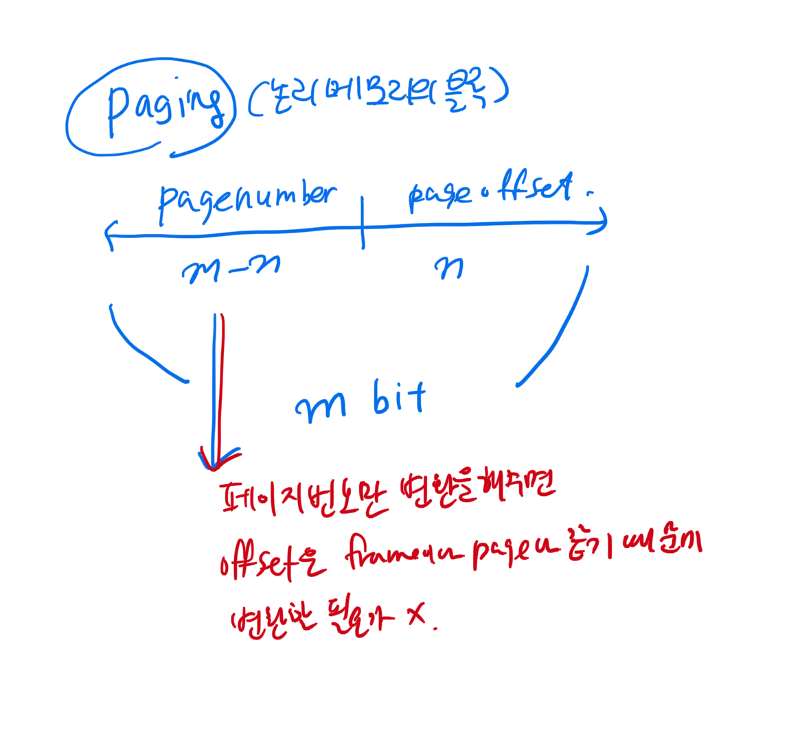

#### 페이징 하드웨어 - MMU

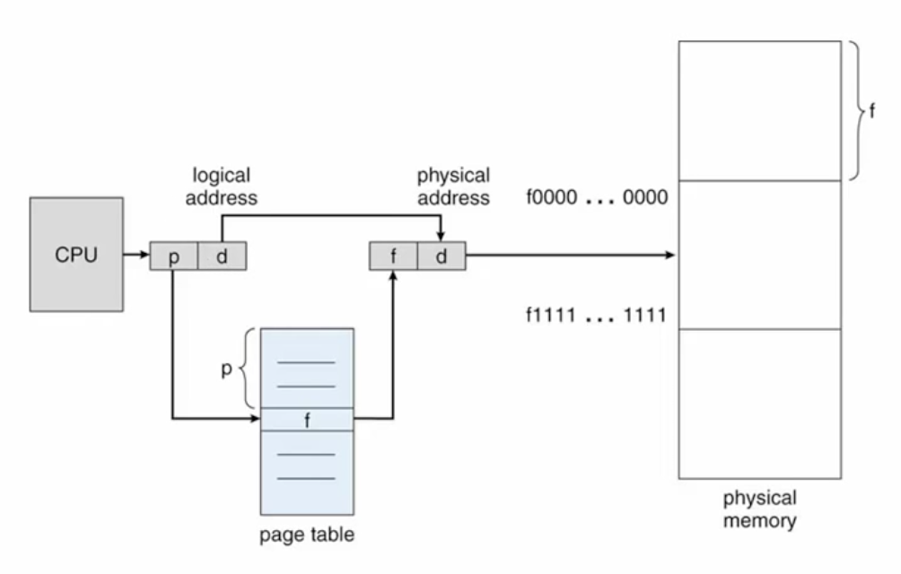

페이징은 외부단편화는 해결하지만 내부 단편화가 생기게 된다. 내부단편화는 페이지 크기보다 작은 메모리를 요청하는 경우에 발생한다. 페이지 크기가 작으면 내부 단편화를 감소시킬 수 있지만 페이지 테이블의 크기가 증가하게 된다. 그래서 현재 운영체제에서는 보통 4KB로 페이지의 크기를 할당한다. 

**프레임 테이블**

운영체제가 관리하는 메모리 프레임의 사용 정보를 저장. 

**페이징과 문맥 교환**

페이지 테이블을 재설정하기 위해 문맥 교환 시간이 증가하게 된다. 

**공유 페이지**

비교적 간단하게 메모리 공유를 지원한다. 

#### 페이지테이블의 구현 

유의해야할 점은 페이지 테이블도 메모리에 저장한다는 것이다. 

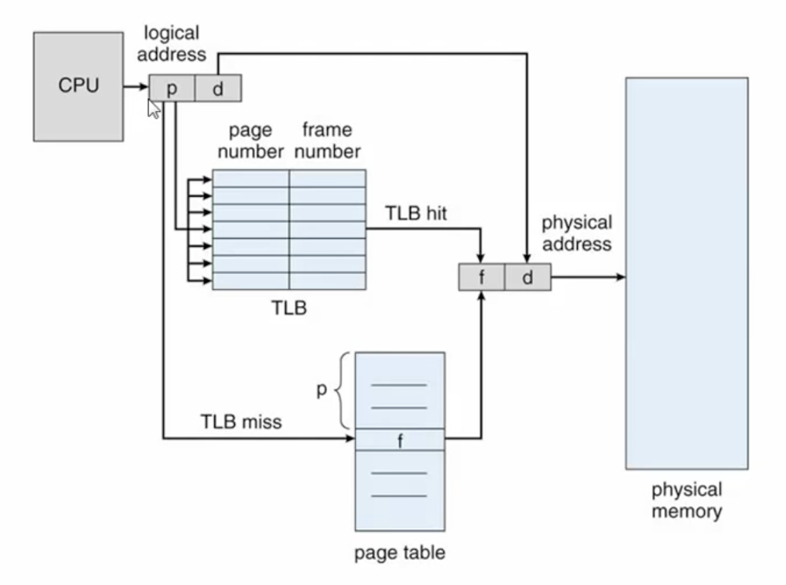

TLB miss가 나면 TLB가 없을 때보다 성능이 안 좋다. 그래서 최대한 TLB hit가 많이 나도록 설계되어야 한다. 

#### TLB (Translation Look-aside Buffer)

TLB miss가 났을 때 교체를 어떻게 해야 나중에 hit가 날 확률이 높아질까? 

**Address-space Identifier (ASID)**

**Effective Memory-Accesss Time (EAT)**

$EAT = (m+\epsilon)\alpha +(2m+\epsilon)(1-\alpha), \epsilon=\text{TLB success time}, m=\text{Memory access time}, \alpha=\text{TLB hit ratio}$

TLB hit 면 물리메모리 접근 시간과 TLB 접근 시간이, 실패면 두 번의 메모리 접근과 TLB 접근 시간이 소요된다. 

#### 페이지 테이블의 구조 

실제 컴퓨터 시스템에서는 페이지 테이블의 크기가 매우 크기 때문에 페이지 테이블을 연속된 메모리 공간에 배치하기가 어렵다. 

그래서 크기가 큰 페이지 테이블을 처리하기 위한 방법이 존재한다. 

1. 계층적 페이징 

   페이지 테이블 자체를 다시 페이징 = 외부 페이지 테이블 

   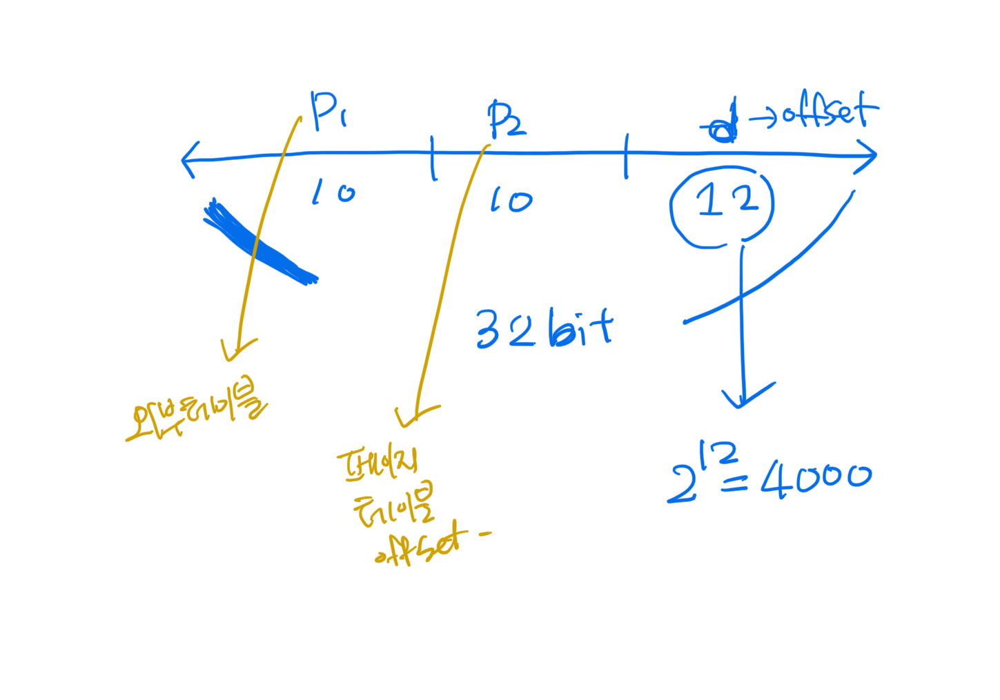

   위 그림은 2단계 페이징을 나타낸 것이다. 

   하지만 계층적 페이지 테이블의 한계가 존재한다. 페이지 단계가 늘어날 수록 비효율적이다. 이미 64비트 체제에서 쓰기 힘들다. 그래서 유효한 페이지들만 테이블에 포함하는 해싱을 사용하여 효율성을 높인다. 

2. 해시 페이지 테이블 (Hashed Page Table)

   논리 주소의 페이지 번호를 해시 값으로 사용한다. 

   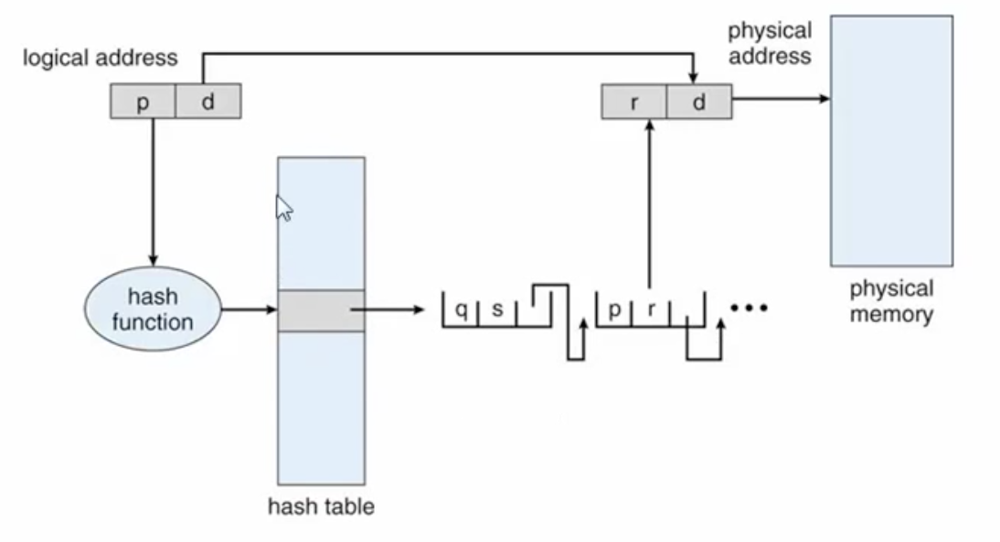

3. 역 페이지 테이블 (Inverted Page Table)

   물리 주소를 논리 주소로 바꿔주는 테이블. RAM의 프레임 번호를 인덱스로 하여 페이지 번호를 찾을 수 있다. 한 시스템에 한 개의 페이지 테이블만 존재하기 때문에 주소 공간을 이용하여 프로세스를 구분시켜야 한다. 

   :smile: 장점

   작은 메모리 공간이 필요하다 

   :disappointed: 단점 

   주소 변환 시간이 길어짐 (검색 비용 증가), 메모리 공유가 어렵다. 

   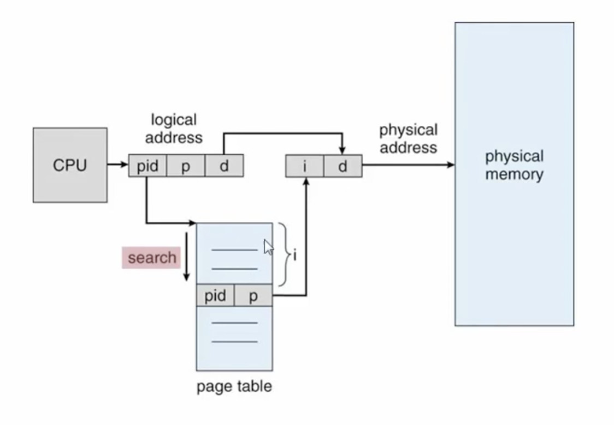

### 세그멘테이션

사용자/프로그래머 관점의 메모리 관리 기법이다. 페이징과 다른 점은 고정된 크기로 분할하는 것이 아닌 논리적으로 ... 

세그먼트의 예시 

- 프로그램의 논리적 단위 

  : method, procedure, function, object, ...

- C 컴파일러 관점 

  : 코드, 전역 변수, 힙, 스택, 표준 C 라이브러리 

페이징의 목적과는 다르게 프로세스를 구분하려는 느낌? ... 다른 프로세스의 메모리에 접근할 수 없도록 

실제로는 페이징과 세그멘테이션을 섞어서 segmented paging을 사용한다. 

#### 세그먼트 테이블 

세그먼트가 사상되는 물리 메모리의 주소를 제공한다. 

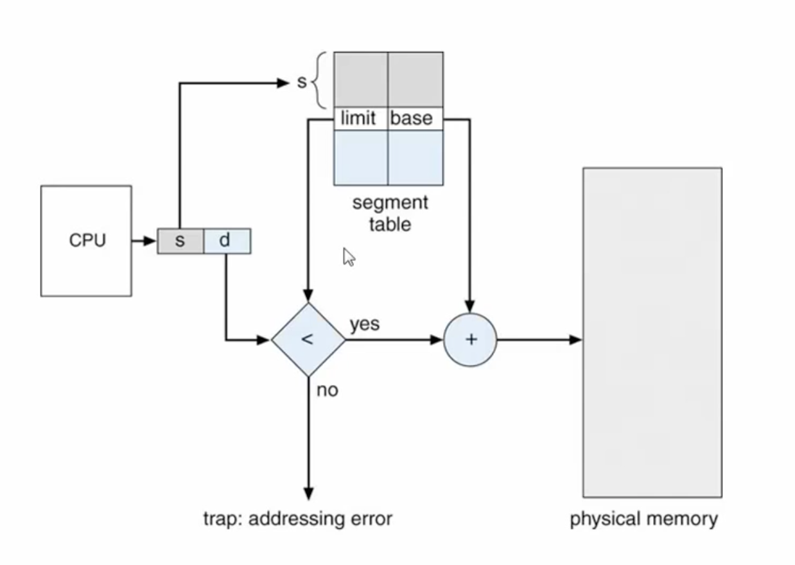

## 가상 메모리 

프로세스 전체가 메모리에 올라오지 않더라도 실행이 가능하도록 하는 기법으로 프로그램이 물리 메모리보다 커도 된다는 장점이 있다. 

실제 메모리와 사용자의 논리 메모리를 분리한다. 프로그램 실행 시 모든 부분이 메모리에 적재될 필요가 없다는 점에 기반한다. ex. 실행될 가능성이 낮은 코드, 과도하게 크게 선언된 데이터 영역, 프로그램의 옵션 부분을 처리하는 코드 

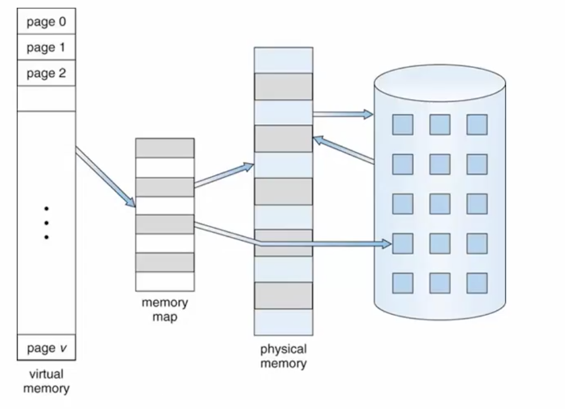

물리 메모리보다 크기가 큰 가상 메모리를 나타낸다. 특정 영역은 보조기억장치에 저장한다. 

### 가상 메모리의 장점 :smile:

1. 프로그램은 실제 물리 메모리의 크기에 제한을 받지 않는다. 
2. 더 많은 프로그램을 동시에 실행할 수 있다. 
3. 프로그램의 스왑에 필요한 입출력이 감소한다. 

### 가상 주소 공간 (Virtual Address Space) 

사용자/프로세스의 논리적인 메모리 공간이다. 다음과 같은 특징을 갖는다. 

- 0번지 부터 시작 

- MMU에 의해 물리 메모리 주소로 변환 

- 힙과 스택은 동적으로 크기가 변화

  실제로 동적 할당되는 경우에만 물리 메모리를 필요로 한다. 

- 빈 공간을 포함한다 (sparse address space) 

가상 메모리를 구현하기 위해서는 두 가지 핵심 기술이 필요하다. 

1. 요구 페이징 
   - 스왑된 페이지를 필요할 때 메모리에 적재한다. 즉, 요구 될때 메모리에 적재한다. 
   - 기본적인 페이지 기법에 따라 주소 변환
2. 페이지 교체
   - 메모리의 공간이 부족하면 특정 페이지를 스왑하여 교체한다. 
   - 어떤 페이지를 교체할지 결정하는 것이 성능에 많은 영향을 미친다. 

## Demand Paging 

논리 주소 공간의 각 페이지가 실제로 필요해 질 때 적재한다. 사용되지 않은 페이지는 메모리에 적재하지 않는다. 이 방법을 통해 물리 메모리의 필요 용량을 감소시키고 스왑에 필요한 시간을 감소시킬 수 있다. 

demand paging은 가상 메모리를 구현하는 중요한 기술로 세그멘테이션 시스템에서도 페이징과 결합하여 구현한다. 

스와핑 기법과 유사하지만 차이점이 있다. 

- 스와핑은 프로세스 전체를 저장/복구하는 반면 demand paging은 필요한 페이지만 저장/복구한다. 
- 그래서 가상 메모리에서는 swapper라는 용어보다 pager라는 용어가 적합하다. 

### 요구 페이징 vs. 페이지 테이블 

요구 페이징은 페이지의 위치를 나타내는 하드웨어가 필요하다. 왜냐하면 메모리에 존재하는 페이지도 있고 아닌 페이지도 있으니까. 

- 유효/무효 비트 (valid/invalid bit)

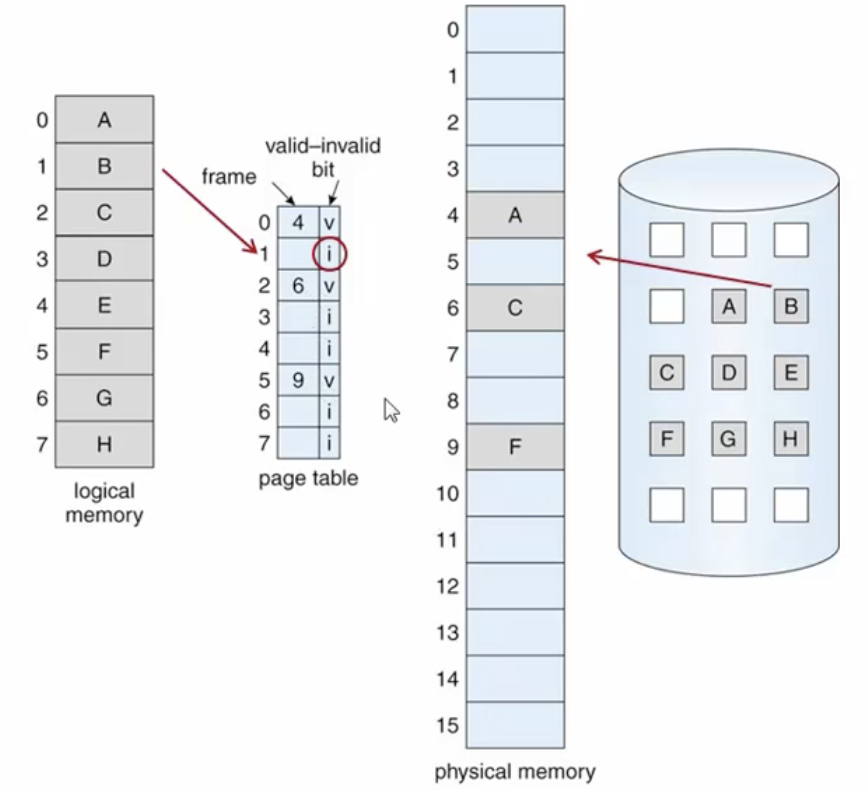

무효로 설정된 페이지를 참조하게 되면 

1. `page fault trap` 발생 (page fault interrupt)

2. 프로세스의 *실행 중단* & 필요한 페이지를 적재하는 입출력이 발생 

   : 새로운 프로세스가 CPU를 할당 받고, 페이지 폴트가 처리되고 난 후 인터럽트에 의해 중단된 프로세스가 재시작된다. 

### 페이지 폴트 처리 

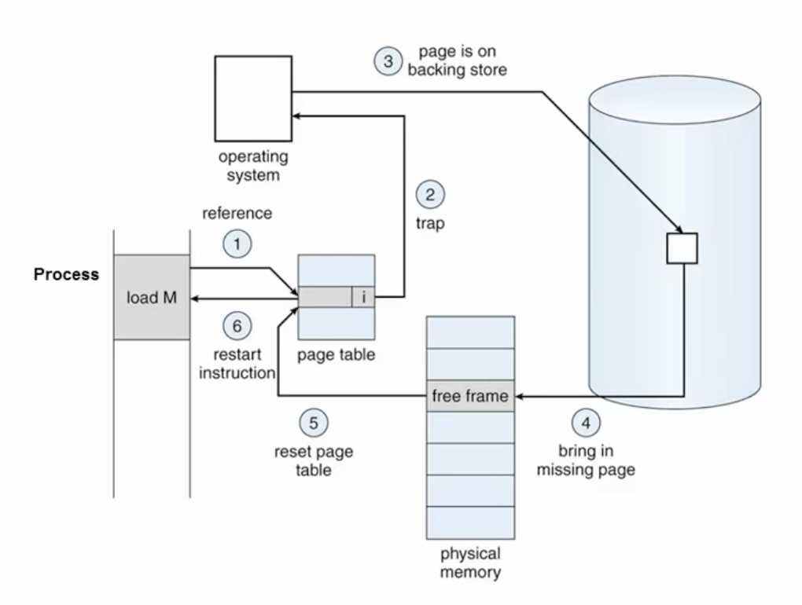

1. 유효하지 않은 페이지를 참조한다. 
2. page fault trap이 발생한다. 
3. OS는 요구된 페이지를 저장장치에서 찾는다. 
4. 요구된 페이지를 저장장치로 부터 물리 메모리로 올린다. 
5. 페이지 테이블의 값을 변경한다. (valid bit로 변경 & 주소값 변경)
6. waiting 상태에 있던 프로세스를 재시작하는 interrupt를 발생시킨다. 

페이지 폴트는 TLB miss랑 다르게 메모리를 2번 참조하는 것이 아니라 하드 디스크를 접근 (I/O) 해야하기 때문에 매우 치명적이다. 

### 요구 페이징의 성능 

페이지 폴트 비용을 고려한 메모리 접근시간은 다음과 같다. 

$EAT = (1-p)\times ma + p\times \text{page fault time}$

- 메모리 접근 시간: $ma$
- 페이지 부재율: $p,\ 0(\le p \le 1)$

기본적으로 페이지 폴트 처리 시간에는 다음이 포함된다. 

- 페이지 폴트에 대한 인터럽트 처리 
- 페이지를 저장장치로부터 다시 읽어서 적재 
- 프로세스를 재시작

### 요구 페이징의 성능 고려 사항 

1. 스왑 공간의 효율성을 높인다. 
2. `페이지 폴트율을 최소화한다. `
   - 페이지 교체 알고리즘을 잘 짠다. 

## 페이지 교체 

- 메모리 과할당 

  : 물리 메모리 공간이 모두 할당된 상태 

- 메모리 과할당 상태의 해소 방법 

  1. 프로세스를 종료 

     : 사용자에게 투명해야 하는 요구 페이징의 특성 위배 

  2. 프로세스를 스와핑 

     : 멀티 프로세싱 정도를 낮춤 

  3. 일부 페이지를 스와핑 

     : 페이지 교체 (page replacement)

### 페이지 교체의 필요성 

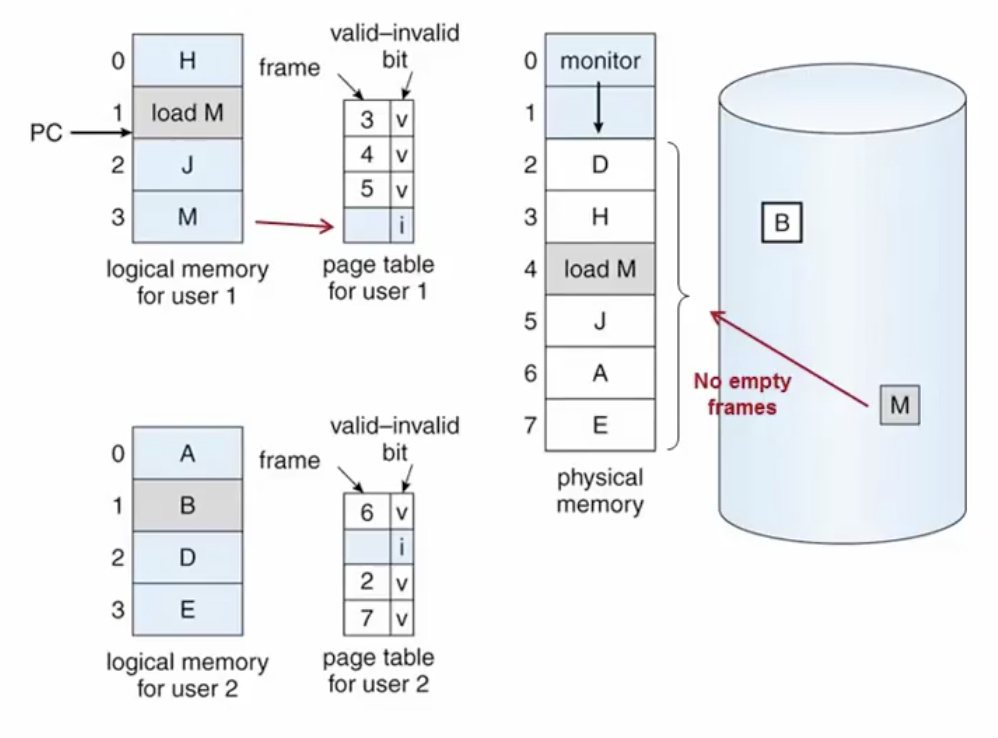

user1이 M을 요청하는데 페이지 테이블에 존재하지 않는다. M을 저장장치로 부터 불러와야하는데 메모리가 가득찼다. 이 때 페이지 교체가 필요하다. 

### 페이지 교체 비용 (overhead)

페이지 교체 비용은 성능에 많은 영향을 미친다. 페이지 교체를 포함한 페이지 폴트 처리는 `디스크 접근 횟수`가 2배가 된다. 

1. 희생 페이지/프레임을 스왑 공간에 저장 
2. 새 페이지를 읽어서 확보한 프레임에 적재 

 이에 페이지 교체 비용을 개선하는 방법을 알아보자. 

- 변경 비트 (modify bit, dirty bit) 사용 (write가 되었는지)

  - 각 페이지나 프레임에 적용 

  - 만약 그 페이지가 메모리에서 사용되고 있는 동안 변경되지 않았다면 그 페이지는 예전에 읽어올 때 저장되어 있던 것과 같다. 그렇기 때문에 이러한 페이지가 희생자가 되면 굳이 다시 저장장치에 저장할 필요가 없게 되는 것이다. (dirty bit = clean)
  - 변경 비트가 설정된 경우에만 스왑 공간에 저장한다. 

### 페이지 교체 알고리즘 

변경 비트를 사용하더라도 페이지 교체는 성능에 많은 영향을 끼치기 때문에 페이지 폴트 발생 비율을 줄이는 것이 중요하다. 

> 페이지 교체 알고리즘의 목표는 결국 `page fault rate의 최소화`이다. 

#### FIFO 

메모리에 적재된 시간이 가장 오래된 페이지를 교체한다. 구현은 간단하지만 최적의 성능을 보장할 수는 없다. 

:disappointed: 벨라디의 모순 

: 프레임의 개수가 많아지더라도 페이지 부재율이 높아지는 현상 

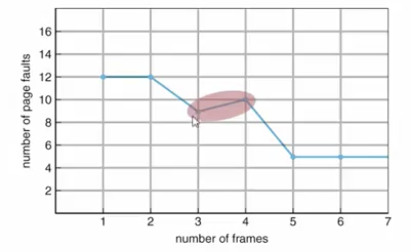

 이러한 현상때문에 실제로는 잘 쓰이지 않는다. 

#### 최적 페이지 교체 (Optimal Page Replacement) 

다른 모든 알고리즘보다 페이지 부재율이 낮으면서 Belady의 모순이 발생하지 않는 페이지 교체 알고리즘으로 `앞으로 가장 오랜 시간 동안 사용되지 않을 페이지를 교체` 한다. 

하지만 잘 생각해보면 미래를 어떻게 알까? 이 방법은 실제로는 사용할 수 없는 방법이고 다른 알고리즘들의 성능을 평가하기 위해 사용된다. 

#### LRU 페이지 교체 (Least Rencently Used)

최적 페이지 교체 알고리즘에 근사하는 방법으로 `가장 오랜동안 사용되지 않은 페이지` 를 교체한다. 

이 알고리즘이 거의 최적이기 때문에 실제로 대부분 LRU를 사용한다. 

:smile: LRU 알고리즘 구현의 고려 사항 

- 페이지들을 최근에 사용한 시간 순서대로 나열할 수 있어야 한다. (Linked List)

- `하드웨어의 지원이 필요하다. `

  모든 메모리 참조에 대해 참조 시간 정보를 갱신해야 하기 때문이다. 

##### LRU 알고리즘의 구현 방법 

1. 페이지 사용 시간 기록 
   - CPU에 논리적 시계나 카운터 추가 
   - 교체 시에 페이지 테이블을 검색하여 LRU 페이지 찾음 
2. LRU 스택 유지 
   - 페이지의 번호를 리스트로 구성 
   - 새로 참조된 페이지는 스택의 top으로 이동 
   - LRU페이지는 스택의 bottom 페이지로 결정 
   - 실제 구현에 적합하다. 

스택 알고리즘이라고도 부른다. Belady의 모순 현상이 나타나지 않는 페이지 교체 알고리즘이다. 

##### LRU 근사 페이지 교체 (Approximation)

실제로 LRU 페이지 교체의 정확한 구현은 어렵다. 

- 추가 하드웨어가 지원되지 않는 시스템 
- 메모리 참조 때마다 참조 시간 정보/스택을 매번 갱신해야한다. 

:smile: 기본적인 LRU 근사 알고리즘 

- 시간 정보 대신에 참조 유무만 기록 
  - Not Recently Used 알고리즘 
  - 최근에 참조되지 않은 페이지를 교체 
- 페이지 테이블에 참조 비트(reference bit) 추가 
- 초기에 모두 0이며 페이지가 참조될 때 1로 설정된다. 
  - 페이지 교체 시 주기적으로 0으로 재초기화 

:smile: 추가 참조 비트 알고리즘 

- 참고 비트를 확장하여 추가 정보로 활용 
- LRU에 근접하는 과거 참조 정보 생성 

:smile: 2차 기회(Second Chance) 알고리즘 

- 한 번 참조된 페이지에게 추가의 기회를 부여 
- 참조 빈도가 높은 페이지는 계속 남아 있을 기회를 가짐 

#### 카운팅 알고리즘 

각 페이지의 참조 횟수를 기록하여 활용한다. 하지만 실제 구현이 쉽지 않고 최적 알고리즘에 잘 근사하지 못한다. 

##### LFU (Least Frequently Used)

##### MFU (Most Frequently Used)

### 페이지 버퍼링 

요구 페이징의 디스크 입출력 시간을 개선하는 방법 

